# Arbitrage Claw — Product Definition

**Status:** Tier C preview · **Day One freeze** (2026-06-23) · see [FREEZE.md](./FREEZE.md)  
**Route:** `/my-shop` · **Appliance ID:** `my-shop`  
**Display name:** Arbitrage Claw · **Workspace title:** Margin & fulfillment desk

---

## North star

Arbitrage Claw is the **sovereign commerce desk** — ideate → generate → list → watch spread → fulfill — without renting a SaaS ops stack.

It is **not** a white-label Shopify admin. It is **not** implied live marketplace access at $3,999 until bridges validate on the appliance.

Primary job (preview today):

1. **Scaffold the journey** — show every stage honestly (demo / roadmap / notify)
2. **Margin thesis** — local spread watchlist + LLM briefs on demo ingest
3. **Fulfillment preview** — demo pipeline + claw/mesh intent (physical lane horizon)

Primary job (post–Day One waves):

4. **Connect channels on eno2** — read-only → list → order → fulfill writeback
5. **Grow with operator** — Scout → Desk Lead leveling (see [LEVELING-BUILD-PLAN.md](./LEVELING-BUILD-PLAN.md))

---

## Operator journey (ideate → cash)

One desk, six stages. Preview shows all stages in roadmap; live bridges unlock per [COMMERCE-BRIDGE-ROADMAP.md](./COMMERCE-BRIDGE-ROADMAP.md).

```mermaid
flowchart LR
  subgraph ideate [Ideate]
    N[Niche / thesis]
    R[Research SKUs]
  end
  subgraph generate [Generate]
    D[Design / mockups]
    C[Listing copy]
  end
  subgraph source [Source]
    AE[AliExpress DS]
    POD[Printify catalog]
    INV[Own inventory]
  end
  subgraph list [List]
    SH[Shopify]
    EB[eBay / Etsy]
    TT[TikTok Shop]
  end
  subgraph watch [Watch]
    M[Margin alerts]
    S[Stock sync]
  end
  subgraph fulfill [Fulfill]
    P[POD ship]
    CL[Claw pick/pack]
    TR[Tracking writeback]
  end
  ideate --> generate --> source --> list --> watch --> fulfill
```



| Stage | Operator question | CurXor surface | Claw synergy |
|-------|-------------------|----------------|--------------|
| **Ideate** | What should I sell? | Thesis journal · niche picker · spread ideas | LLM chat · Creator for brand angle |
| **Generate** | What does the offer look like? | Mockup lane · title/description drafts | Creator Claw · Forge for custom skills |
| **Source** | Where do I buy / print? | Supplier watchlist · landed cost calc | AliExpress DS · Printify (eno2) |
| **List** | Where do I sell? | Channel cards · publish queue | Shopify hub · eBay · Etsy · TikTok |
| **Watch** | Is margin still there? | SKU spread desk · alerts | Price scrape intents (eno2) |
| **Fulfill** | How does it ship? | Pipeline · POD order · tracking | Printify webhooks · claw mesh |

---

## Personas & channels (research-backed)

### Print-on-demand merch (Printify → Shopify / Etsy / eBay)

- **Printify** exposes REST (`api.printify.com/v1`): shops, catalog, products, orders, webhooks. Auth: Personal Access Token or OAuth for multi-merchant platforms.
- **Native channel sync:** Printify already pushes to Shopify, Etsy, eBay, Amazon when linked in their UI — **CurXor value** is sovereign desk + margin rules + local LLM copy, not replacing Printify’s native sync on day one.
- **API value:** headless checkout, bulk provider swaps, cost pull for margin math, webhook-driven fulfillment on **your metal**.

### Owned storefront (Shopify)

- **Shopify Admin API is GraphQL-first** (REST legacy). New apps must use GraphQL; quarterly API versions; OAuth per shop; calculated query cost + bulk operations for catalog/order export.
- **CurXor pattern:** eno2 bridge `commerce.shopify.*` — scopes minimal (read products/orders first).

### Marketplace flips (eBay · Etsy)

- **eBay:** Inventory API (SKU → offer → publish) + Fulfillment API (orders, shipping). OAuth 2.0; seller must opt into business policies.
- **Etsy:** Open API v3 — OAuth 2.0 + PKCE; scopes `listings_r/w`, `transactions_r/w`; app approval for production.
- **Persona:** side hustle flips, sports cards, collectibles — often **eBay-first**; Etsy for handmade/POD overlap.

### Social commerce (TikTok Shop)

- **TikTok Shop Partner API** — OAuth 2.0; US vs Global Partner Center; scopes for product, order, inventory, logistics. Approval 2–3 business days typical.
- **Reality:** many sellers run **Shopify as hub** with TikTok channel — CurXor should support hub-and-spoke, not require N duplicate integrations on day one.

### Sourcing (AliExpress / wholesale)

- **AliExpress Open Platform** — Dropshipping APIs (product search, detail, place order, tracking). Seller must join Dropshipping Center; developer AppKey + OAuth session; commercial vs self-developer token TTL differs.
- **Risk:** platform terms change; some legacy DS docs marked deprecated — treat as **Wave 3+** after Shopify/eBay read paths prove eno2 egress.

### Collectibles (sports cards · TCG · sealed)

- **eBay** remains primary programmatic path (Inventory + Fulfillment).
- **TCGplayer** has REST catalog/pricing APIs but **new third-party access is restricted**; sellers use CSV import/export, MassPrice, approved POS partners — CurXor should plan **CSV + eBay** before native TCGplayer.
- **Whatnot / live selling:** inventory side sync immature — roadmap card only in preview.

---

## Workspace tabs (target)

| Tab | Preview (now) | Live (waves) |
|-----|---------------|--------------|
| **Overview** | Roadmap · notify stub · persona | Go-live checklist per connected channel |
| **Ideate** | Demo thesis cards | Niche + margin thesis journal |
| **Generate** | “Coming soon” + Creator handoff | Mockup queue · listing drafts |
| **Margins** | Demo spread table | Live scrape + alerts |
| **Pipeline** | Demo orders | Multi-channel order ingest |
| **Fulfill** | FRE lanes · mesh preview | Printify / claw / tracking writeback |

Level gates: see [LEVELING-BUILD-PLAN.md](./LEVELING-BUILD-PLAN.md) — L1 Scout sees Overview only; L2+ unlocks margins/pipeline preview.

---

## Preview honesty (Tier C — permanent until flagship)

Same contract as Signal / Swarm / Kin:

| Rule | Implementation |
|------|----------------|
| Coming Soon badge | Header + sidebar `· Soon` |
| No false Go Live | No “connected to Shopify” without eno2 receipt |
| Demo labeled | “Preview · local only” on pipeline and spreads |
| Chat honest | `previewAgentPromptBlock` + preview assist replies |
| Notify stub | Local flag only (no external waitlist until chosen) |
| One demo skill at L1 | `ingest_order` only |

**GTM line:** “See the full commerce journey on your appliance — connectors ship wave by wave after validation.”

---

## Architecture (sovereign)

```
Arbitrage Claw UI  →  digital intent  →  eno2  →  commerce bridges  →  external APIs
        ↑                                      ↓
   local LLM briefs                    receipts → SSE digital stream
   claw mesh (physical lane)           credentials in /etc/curxor/ (never LLM)
```

- **Never** call Shopify / eBay / Printify from the LLM or engine loop directly.
- **Credentials** live on appliance; bridges execute REST/GraphQL.
- **Creator Claw** owns creative egress; **Arbitrage** owns commerce egress (orthogonal tools).

---

## Sequencing (CTO recommendation)

| Wave | Scope | Why first |
|------|--------|-----------|
| **AB preview** | ✅ Roadmap + demo desk + leveling | Honest at $3,999 |
| **Wave 1** | Shopify GraphQL read (products, orders) + margin watch from real COGS | Hub for TikTok/Etsy spokes |
| **Wave 2** | eBay Inventory read + Fulfillment ingest | Flips / collectibles persona |
| **Wave 3** | Printify cost + order create + webhooks | POD merch without fake pipeline |
| **Wave 4** | Etsy listings + receipts | Side hustle overlap |
| **Wave 5** | TikTok Shop via hub or direct Partner API | Social seller persona |
| **Wave 6** | AliExpress DS search + landed cost | Sourcing arbitrage (highest policy risk) |

Do **not** parallel all channels — proves nothing at demo velocity and confuses buyers.

---

## References

- Leveling: [LEVELING-BUILD-PLAN.md](./LEVELING-BUILD-PLAN.md)
- Bridge order: [COMMERCE-BRIDGE-ROADMAP.md](./COMMERCE-BRIDGE-ROADMAP.md)
- eno2 pattern: [../guides/12-digital-action-layer.md](../guides/12-digital-action-layer.md)
- Tier C contract: [../curxor-os/DAY-ONE-BUILD-PLAN.md](../curxor-os/DAY-ONE-BUILD-PLAN.md)
