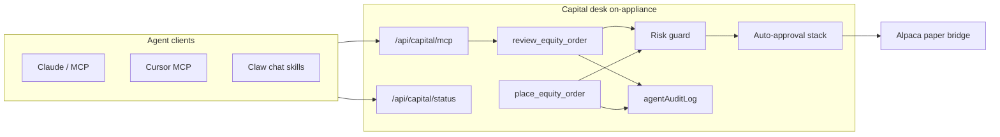

# Capital Claw — Agent & MCP Trading

Sovereign on-appliance agent trading: LLM plans, deterministic preview + risk guard executes, full audit trail. No third-party agent middleware required.

## Competitive landscape (June 2026)

| Product | Model | Capital Claw response |
|---------|--------|----------------------|
| [Robinhood Agentic Trading](https://robinhood.com/us/en/support/articles/agentic-trading-overview/) | Official MCP at `https://agent.robinhood.com/mcp/trading`; isolated agentic account; `review_equity_order` → `place_equity_order` | **Parity tools** on `/api/capital/mcp` — same preview-then-confirm flow; paper via Alpaca on-box |
| [Era](https://era.app/en-GB) | MCP-native finance, explicit permissions, RIA-backed automations | **Permission granularity** — autonomous mode + auto-approval stack + agent kill switch |
| [SignalStack](https://signalstack.com/) | Webhook router → 20+ brokers; alert JSON in, order out | **TradingView webhook** tier + sovereign bridge; no cloud hop for CurXor users |
| [Autopilot](https://www.joinautopilot.com/landing) | Copy-trading marketplace; connect brokerage; proportional mirror | **Pilot marketplace** on sovereign bridge — agent can `sync_pilots` but copy stays policy-gated |
| [Composer](https://www.composer.trade/) | No-code strategy builder + auto execution | **Rule engine + backtest** — agent creates rules; heartbeat evaluates; not cloud black-box |

### CurXor wedge

- **On-appliance MCP** — tools run against local `capital-queue.json`, not a vendor cloud.
- **Risk guard before bridge** — preview always hits concentration, PDT, daily caps.
- **Auto-approval stack** — paper-first notional caps; agent chat is a separate toggle from armed rules.
- **Kill switch** — one desk toggle blocks all MCP / Claw chat execution.
- **Audit log** — every preview, execute, block, and MCP tool call is persisted locally.

## Architecture



## Setup

### 1. Desk prerequisites

1. Complete FRE — paper mode, seed watchlist.
2. Set Alpaca paper keys in `digital.env` (see [GETTING-STARTED.md](./GETTING-STARTED.md)).
3. Open **Go Live** — all steps green.

### 2. Auto-approval & agent policy

On the **Auto-approval stack** panel (Standard+):

| Toggle | Default | Purpose |
|--------|---------|---------|
| Enable stack | on | Master switch |
| Paper only | on | Block auto-approve in live mode |
| Max notional | $500 | Cap for auto-submit |
| Claw / Claude / MCP chat trades | on | Allow `source=agent` auto-approve when under cap |
| Require preview before agent confirm | on | MCP must pass `confirm: true` after review |

### 3. Connect MCP

**Claude Code:**

```bash
claude mcp add capital-claw --transport http http://127.0.0.1:3080/api/capital/mcp
```

**Cursor:** Settings → MCP → add HTTP server `http://127.0.0.1:3080/api/capital/mcp`

**Verify:**

```bash
curl -s http://127.0.0.1:3080/api/capital/mcp | jq .name,.tools[].name
```

### 4. Preview then execute

**MCP JSON-RPC:**

```json
{
  "jsonrpc": "2.0",
  "id": 1,
  "method": "tools/call",
  "params": {
    "name": "review_equity_order",
    "arguments": { "symbol": "SPY", "side": "buy", "quantity": 1 }
  }
}
```

Then, if `autoApproveEligible` and no risk note:

```json
{
  "jsonrpc": "2.0",
  "id": 2,
  "method": "tools/call",
  "params": {
    "name": "place_equity_order",
    "arguments": { "symbol": "SPY", "side": "buy", "quantity": 1, "confirm": true }
  }
}
```

**Status API (Claw chat / UI):**

```json
{ "action": "agent_execute_trade", "ticker": "SPY", "qty": 1, "actionTrade": "buy", "confirm": false }
{ "action": "agent_execute_trade", "ticker": "SPY", "qty": 1, "actionTrade": "buy", "confirm": true }
```

### 5. Kill switch

Desk **Agent & MCP trading** panel or API:

```json
{ "action": "set_agent_kill_switch", "agentKillSwitch": true }
```

Blocks all agent/MCP trades until cleared. Logged in `agentAuditLog`.

### 6. Audit trail

```json
{ "action": "agent_audit_list", "limit": 25 }
```

MCP: `list_agent_audit`

## Claw chat skills

| Skill | Kind | Behavior |
|-------|------|----------|
| `preview_trade` | plan | Single-ticker preview via trade executor |
| `agent_execute_trade` | digital | Preview then confirm on selected asset |

Skills respect the same kill switch, `requireAgentPreview`, and auto-approval policy as MCP.

## Safety checklist

- [ ] Paper mode + paper-only auto-approval at launch
- [ ] `requireAgentPreview` on until you trust the stack
- [ ] Max notional set below your comfort threshold
- [ ] Agent kill switch tested once
- [ ] Review `agentAuditLog` after first MCP session
- [ ] Do not expose dashboard port beyond LAN without `CURXOR_LAN_AUTH_TOKEN`

## Related docs

- [BEST-IN-CLASS.md](./BEST-IN-CLASS.md) — full competitive map
- [GETTING-STARTED.md](./GETTING-STARTED.md) — Alpaca, rules, pilots
- Agent workspace `TOOLS.md` — skill + MCP catalog for Claw context
