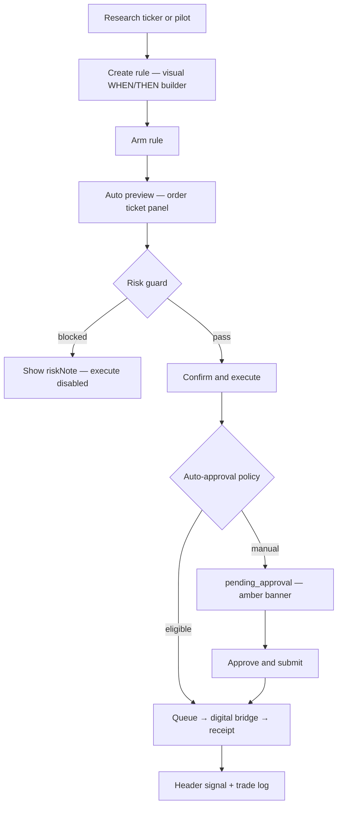
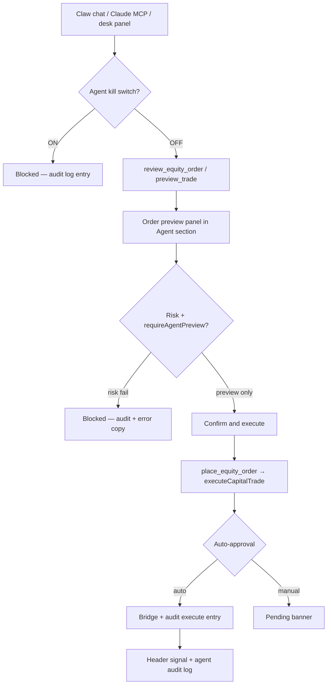
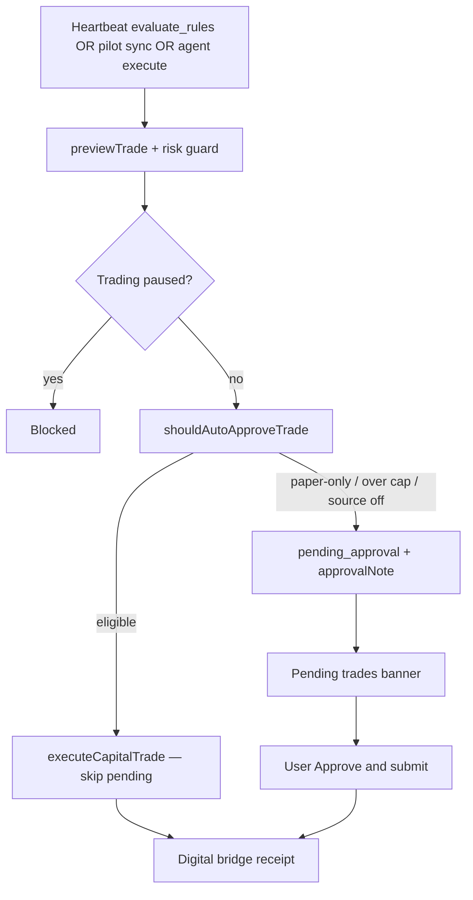
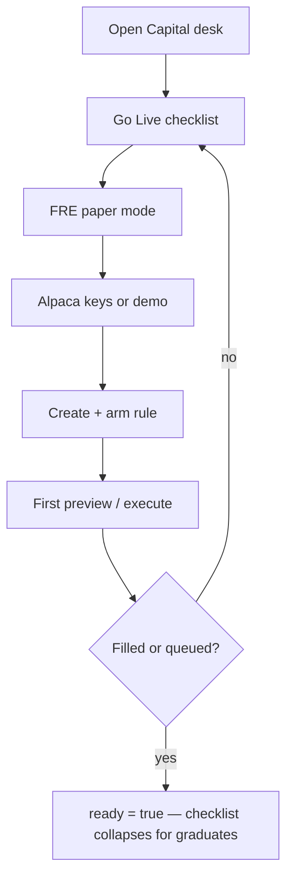

# Capital Claw — Execution Flow

User journey maps for rule trades, agent trades, auto-approval, and go-live. Panel visibility follows `MyCapitalApp.tsx` experience gating.

## Experience levels

| Level | Visible execution surfaces |
|-------|---------------------------|
| **Beginner** | Go Live checklist, research (basic), pilots, risk, rule engine (visual builder) |
| **Standard** | + auto-approval, agent/MCP trading, brokers, intel digest, trade log, pending banner |
| **Expert** | + full research chart/chatter depth (research panel), all Standard panels |

Go Live stays visible at Standard+ until the paper checklist is complete (`!goLive.ready`).

---

## 1. Rule trade (Beginner → Standard)

**Delight cues:** Order preview card before submit; header copy maps status (`queued`, `pending_approval`, `filled`, `blocked_risk`); pending banner shows source + `approvalNote`.

---

## 2. Agent / MCP trade (Standard+)

**MCP connect:** `GET /api/capital/mcp` for instructions; JSON-RPC `tools/call` for `review_equity_order` and `place_equity_order`.

---

## 3. Auto-approve path (Standard+)

Policy toggles: `autoApproveRules`, `autoApproveIntelActions`, `autoApprovePilotSync`, `autoApproveAgentChat`, `maxAutoNotionalUsd`, `paperOnly`.

---

## 4. Go-live / paper readiness (Beginner)

Standard+ users who have not finished the checklist still see Go Live until `ready`.

---

## Header signal reference

| Status | User sees |
|--------|-----------|
| `pending_approval` | Awaiting your approval · BUY 1 SPY · reason |
| `queued` | Queued · publishing via digital bridge |
| `filled` | Filled · price when available |
| `blocked_risk` | Blocked by risk guard · detail |
| Agent preview | Preview ready — review below, then confirm |

Implemented in `lib/capital-trade-feedback.ts`.

---

## V4.4 execution gates (shipped)

| Gate | Where | Behavior |
|------|-------|----------|
| Live money | `CURXOR_CAPITAL_LIVE_ENABLED` + go-live `live_money` step | Live trades blocked until env + desk confirm |
| SnapTrade | Brokers panel → `/api/capital/snaptrade` | OAuth link scaffold; bridge dispatch when linked |
| Plaid | PFM panel → `/api/capital/plaid` | Link bank, sync transactions into PFM |
| TradingView | Brokers panel wizard | Webhook URL, secret, test ping |

---

## Related docs

- [BEST-IN-CLASS.md](./BEST-IN-CLASS.md) — competitive positioning + Gap Analysis V4.3/V4.4
- [AGENT-TRADING.md](./AGENT-TRADING.md) — MCP setup and safety checklist
- [V4-BACKLOG.md](./V4-BACKLOG.md) — remaining P2 (bridge worker, full tax lots, options)
