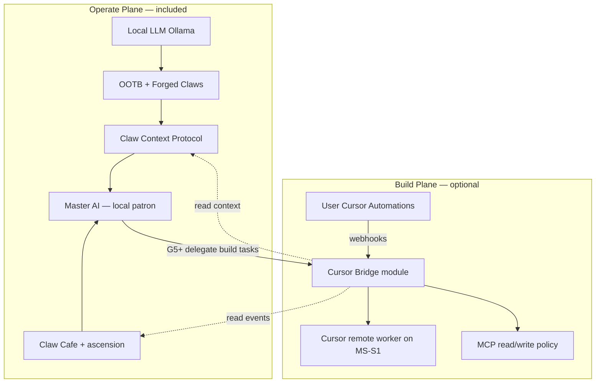
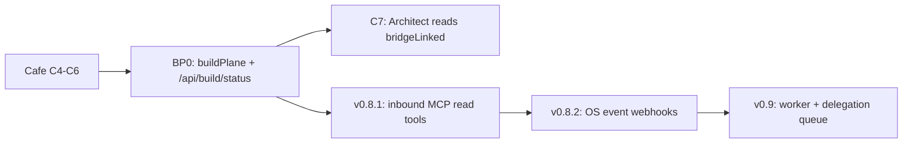

# CurXor OS — Build Plane & Cursor Bridge (vision)

> **Status:** BP0 + BP1 **shipped** (Settings + `/api/build/status` + inbound MCP v0.8.1) · v0.8.2+ deferred · **not GTM**  
> **Owner:** Ankur (product) · CTO agent (architecture)  
> **Related:** [CLAW-CAFE-PRD.md](./CLAW-CAFE-PRD.md) (Master AI) · [GROWTH-LEVEL-FRAMEWORK.md](./GROWTH-LEVEL-FRAMEWORK.md)

---

## Summary

CurXor ships two planes:

| Plane | What | GTM |
|-------|------|-----|
| **Operate** | Ten Claws + Forge + Cafe + Master AI on bare metal | **Yes** — sovereign appliance |
| **Build** | Optional **Cursor Bridge** — extend, debug, automate the OS | **No** — power-user overlay |

**Core promise unchanged:** $3,999 once · local Claws · $0/mo API rent for inference.  
**Optional overlay:** user’s **Cursor subscription** for builder workflows (remote worker, automations, MCP).

Inspired by Cursor Compile 26 direction: always-on automations, computer use, remote control — integrated **without** making cloud agents the default brain of the appliance.

---

## Why Cursor fits (not xAI as Build Plane)

| Option | Role in CurXor | Build Plane? |
|--------|----------------|--------------|
| **Cursor Bridge** | Code, automations, MCP, remote worker **on the appliance** | **Yes** |
| **xAI / Grok** | Optional **frontier inference** (BYOK) in Settings — same class as OpenAI/Anthropic | **No** — not a builder/governor layer |

xAI is a **model provider**. Cursor is a **builder environment**. The Architect NPC represents **Build Plane**, not frontier chat.

Strategic note: long-term optionality toward Cursor as partner; **no partnership claim in GTM** until pricing and legal are clear.

---

## Architecture



### Cursor Bridge capabilities (phased)

| Phase | Capability |
|-------|------------|
| **v0.8 spec (BP0)** | Settings panel · connection status · MCP schema doc · **Shipped** |
| **v0.8.1 (BP1)** | MCP server on appliance: read CCP summary, Cafe ledger, Forge fleet, `/api/*/status` · **Shipped** |
| **v0.8.2 (BP2)** | Webhook emitters: `forge.claw_minted`, `go_live.failed`, `ota.available`, `eno2.down` · **Shipped** |
| **v0.9 (BP3)** | Remote worker setup wizard · delegation queue schema · `/api/build/worker` · **Shipped** |
| **v0.9.1 (BP4)** | Master AI delegation UI · ascension gates · `/api/build/delegation` · **Shipped** |
| **v0.10 (BP5)** | Real Cursor OAuth · live worker · delegation execution · MCP write · webhooks (B01–B05) |
| **v0.10.1 (BP6)** | Delegation **Kanban board** · extended queue statuses · [IDEA-B06](./CURRENT-ROADMAP.md#idea-b06-delegation-board--program-bp6) |
| **v0.10.2 (BP7)** | **Build Spaces** — per-repo worktree + shared context on box · [IDEA-B07](./CURRENT-ROADMAP.md#idea-b07-build-spaces--program-bp7) |
| **Deferred default** | Cursor **cloud** agents with write access to production Claw stores |

### Sovereignty rules

1. **Claws never require Cursor** to run.
2. **Default inference** stays local; Cursor is not the operator-facing chat for Capital/Work/Creator.
3. **eno2** still gates outbound agent traffic; Cursor Bridge uses **eno1** / dev paths for git, not customer SMTP.
4. **Cloud automations** are user opt-in on **their** Cursor account — not bundled as “included.”
5. **Write MCP tools** require explicit policy (tier + toggle + confirm).

---

## Universal prerequisites

Build Plane is not a Cafe-only feature. These **OS-wide foundations** must exist before the Bridge is real (Architect NPC can ship earlier with a stub — see sequencing below).

### Already in repo (reuse)

| Layer | Location | Notes |
|-------|----------|-------|
| **CCP** | `lib/claw-context-store.ts`, `lib/claw-context-service.ts`, `/api/mesh/context` | `sourceAppId: "bridge"` exists; wire read policy |
| **Settings + linking** | `lib/user-settings-types.ts`, `lib/provider-link-sessions.ts` | Guided-link pattern — **wrong bucket** today (Cursor listed as frontier inference) |
| **MCP client** | `/api/mcp`, `lib/mcp/mcp-client.ts`, Settings “MCP & egress” | Outbound only — CurXor calls external servers |
| **Per-Claw webhooks** | `lib/work-webhook-emitter.ts`, content/capital ingress | Pattern exists; not OS-wide |
| **Cafe ascension** | `lib/claw-cafe-ascension.ts`, event ledger | Gating for delegation + Architect discover |
| **Network planes** | `docs/guides/03-networking.md` | eno1 command / eno2 egress — needs **build-path** classification in code |

### Must add (universal)

| # | Foundation | Purpose | Target |
|---|------------|---------|--------|
| 1 | **`buildPlane` settings block** | Separate Operate vs Build; single source for “link active” | **BP0** · **Shipped** |
| 2 | **`GET /api/build/status`** | Sanitized bridge state for Settings, Cafe, future Master AI | **BP0** · **Shipped** |
| 3 | **Inbound MCP server** | Cursor connects **to** CurXor (read CCP, status, Cafe ledger) | v0.8.1 · **Shipped** |
| 4 | **CCP bridge read policy** | Scope/matrix for what `bridge` may read vs write | v0.8.1 · **Shipped** |
| 5 | **OS event bus** | `emitOsEvent()` → Cafe ledger + optional signed webhook | v0.8.2 · **Shipped** |
| 6 | **Network path tags** | Classify fetch/git as `operate` \| `build` \| `egress` | v0.8.1 · **Shipped** |
| 7 | **Delegation queue schema** | `/etc/curxor/build-delegation-queue.json` + audit log | v0.9 · **Shipped** |
| 8 | **Cafe spatial hook** | `blueprint_nook` station + NPC opacity from `bridgeLinked` | Cafe **C7** |

**Critical mismatch to fix in BP0:** Cursor in `lib/frontier-providers.ts` is a **frontier inference** provider. Build Plane connection state must live in `userSettings.buildPlane`, not `intelligence.connectedProviders.cursor`.

### Suggested `buildPlane` schema (BP0)

```ts
buildPlane: {
  enabled: boolean;
  linkStatus: "disconnected" | "linked" | "error";
  linkedAt: string | null;
  workerStatus: "unknown" | "online" | "offline";
  allowDelegation: boolean;   // G5+ gate (default false)
  allowWriteTools: boolean;     // explicit policy (default false)
  webhookSecret: string | null; // inbound automations (optional)
}
```

### Sequencing



| When | Work |
|------|------|
| **BP0** (Forge / build chat) | Settings schema · `/api/build/status` · Settings “Builder overlay” panel stub · decouple Cursor frontier UX from bridge state |
| **Cafe C7** | `blueprint_nook` · Architect NPC opacity from status API (mock `linked` OK until real link) |
| **v0.8.1** | Inbound MCP server on eno1 · CCP read tools · network path tags |
| **v0.8.2** | `emitOsEvent`: `forge.claw_minted`, `go_live.failed`, `ota.available`, `eno2.down` |
| **v0.9** | Remote worker wizard · Master AI suggest-delegate · audit queue UI |

### BP0 file touch list (implementation hint)

| Area | Files |
|------|-------|
| Schema | `lib/user-settings-types.ts`, `lib/user-settings.ts`, `DEFAULT_USER_SETTINGS` |
| API | `app/api/build/status/route.ts` (new) |
| Settings UI | `components/settings/SettingsWorkspace.tsx` or new `BuildPlanePanel.tsx` |
| Cafe feed | Optional field on `app/api/cafe/status` → `bridgeLinked: boolean` |
| Docs | This file · [DAY-ONE-BUILD-PLAN.md](./DAY-ONE-BUILD-PLAN.md) BP0 row |

### Not needed foundationally

- Cursor cloud agents with write access to production Claw stores
- Full remote worker install (v0.9 — after hardware golden path)
- Master AI delegate UI · **Shipped (BP4 v0.9.1)**
- GTM / storefront Cursor mention
- xAI / Grok in Build Plane

---

## Pricing framing (later — not GTM)

| Layer | Story |
|-------|-------|
| Appliance | Own the box and employees |
| Cursor overlay | Optional builder subscription — “extend your server like a pro” |
| Cloud agent credits | User’s Cursor bill — never subsidized by CurXor |

Analog: Linux is free; JetBrains is optional. Home Assistant is local; Nabu Casa is optional.

---

## Cafe integration — The Architect (easter egg NPC)

**Not Claw #11.** A semi-transparent **Architect** sprite in the pixel room:

| Property | Value |
|----------|-------|
| **Name** | **The Architect** (CurXor-native — not “Cursor Claw”) |
| **Station** | `blueprint_nook` — mezzanine / corner, off main Claw desks |
| **Default** | ~40% opacity, idle, no bubble |
| **Discover** | Patron walks adjacent (L4+) or clicks blueprint object |
| **Inspect copy** | “Builder overlay — optional. Connect in Settings when ready.” |
| **When Cursor Bridge linked** | Opacity → ~85%; faint pulse; bubble: “Builder link active” |
| **No third-party logo** in room sprites (GTM-safe; partnership TBD) |

**Naming note:** Ascension neutral title **“Architect of Wealth”** is unrelated — different fiction layer.

Implementation wave: **Cafe C7+** (easter egg bundle) · `lib/claw-cafe-spatial.ts` station · `CafePixelCanvas` layer.

---

## Master AI delegation (Build Plane)

| Ascension | Build delegation |
|-----------|------------------|
| G1–G3 | Architect visible only as easter egg |
| G4 | Master briefings may mention “Builder overlay available” |
| G5 Consciousness | Patron may **suggest** Cursor Bridge task (user confirms) |
| G6 Infinity | Full delegate queue with audit log on appliance |

Master AI **orchestrates**; Cursor **executes** code/automation when user approves.

---

## Out of scope (this doc)

- Storefront copy mentioning Cursor
- Bundled Cursor seats in appliance price
- xAI/Grok as room NPC
- Cloud-first appliance image

---

## References

- Cursor Automations: https://cursor.com/blog/automations  
- Remote / computer use: https://cursor.com/blog/agent-computer-use  
- Cafe Master AI: [CLAW-CAFE-PRD.md](./CLAW-CAFE-PRD.md)  
- Frontier providers (xAI class): `pillar-4-dashboard/lib/frontier-providers.ts`
