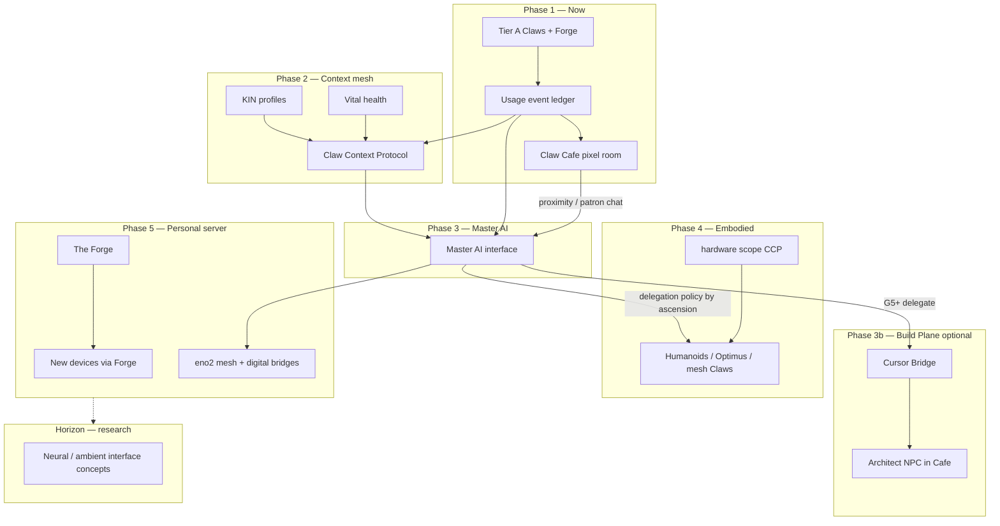

# Claw Cafe — Product Requirements (C0)

> **Status:** C0 locked · ready for C1 build chat  
> **Owner:** Ankur (product vision) · CTO agent (architecture)  
> **Working name:** **Claw Cafe** (rename candidates below)  
> **Route today:** `/claw-cafe` (currently mislabeled **Engage Claw** — will be reframed)  
> **OS layer:** Cafe is **not an operate Claw** — see [CAFE-OS-LAYER-MODEL.md](./CAFE-OS-LAYER-MODEL.md)

---

## One-line vision

**Claw Cafe is the living mirror of CurXor OS use** — a spatial home where every OOTB Claw and every Forge-built Claw appears as a character in a shared room, walking, chatting, and reacting to **real operator activity**, while **app-level progress and cross-app habits** aggregate into **ascension titles** from Sprout to Infinity.

This is not a gimmick office for coders. It is the **habit + identity layer** for a $3,999 sovereign appliance — the thing SaaS dashboards cannot replicate.

**North star (multi-year):** The Cafe game is the **on-ramp** to CurXor’s **Master AI** — a single local interface that knows the operator deeply because it **learned from years of Claw use**, CCP context, and (eventually) embodied devices. Infinity is not a badge; it is the **threshold where delegation to humanoids and new hardware becomes safe**.

See [North star — Cafe → Master AI](#north-star--cafe--master-ai).

---

## C0 decisions (locked)

| # | Decision | Choice |
|---|----------|--------|
| 1 | Visual style | **Pixel art tile room** (Canvas 2D, Pixel Agents lineage) |
| 2 | Ascension titles | **Mythic default** (Goddess of …) + **neutral alt** in Settings (`titleStyle: mythic \| neutral`) |
| 3 | Operator presence | **Playable avatar** — walk the room, proximity inspect Claws |
| 4 | Physical mesh Claws | **Yes, lightweight** — CLAW units appear when vision/motor connected; no full arcade sim at MVP |
| 5 | Infinity | **Built over time** — unlocks Master AI depth + device delegation tiers; not day-one |

**Parallel stream (Ankur):** **Forge capabilities** in the first master build-out — Cafe consumes Forge mint events; Forge build is a separate Agent chat, not blocked on Cafe C1.

---

## What makes us different (vs. the crowd)

Developers have shipped dozens of **“agents in a room”** experiences in 2024–2026. CurXor Cafe must learn from them without copying their job-to-be-done (coding session monitoring).

| Project | What it does | CurXor takeaway |
|---------|--------------|-----------------|
| [Pixel Agents](https://github.com/pixel-agents-hq/pixel-agents) / [agents-in-the-office](https://github.com/gukosowa/agents-in-the-office) | Pixel office; NPC walks to desk/bookshelf based on **Claude Code JSONL** tool events | **Observational mirroring** — animate from real telemetry, not fake loops |
| [AgentRoom](https://github.com/liuyixin-louis/agentroom) | Tauri + Canvas 2D; work room vs break room; per-project layouts | **Room zones** + persist layout per household |
| [Cursor Office](https://github.com/ofershap/cursor-office) | Idle life (coffee, cat, arcade); celebrate on real edits; clickable easter eggs | **Delight when idle** + **objects with secrets** |
| [AgentOffice](https://github.com/harishkotra/agent-office) | Phaser + Ollama; agents **autonomously** talk, hire, assign tasks | **Deferred** to [CLAW-COMMONS-VISION.md](./CLAW-COMMONS-VISION.md) Program CL (G5+) — bounded federated social, not personal Cafe default |
| [AI Agent Cafe](https://github.com/koosoli/AI-Agent-Cafe) | Walk between rooms; **proximity chat**; mastery stars per room; final Architect secret | **Proximity inspect** + **room mastery** + **meta endgame** |
| [AgentCafe](https://agentcafe.dev) | Multiplayer MCP — agents appear when connected | Future: optional **local mesh** presence (eno2 story) |

**CurXor moat (what none of them have):**

1. **Ten operate Claws + Forge** — OOTB employees *and* user-minted / **fusion-born** Claws in one world  
2. **Dual progression** — per-app life-stage titles (L1–L5) **feed** OS-wide ascension (Sprout → Infinity)  
3. **Sovereign appliance** — Cafe runs offline; XP from local stores, not cloud leaderboards  
4. **Growth philosophy** — levels reflect **use and responsibility**, not skill flex  
5. **Easter eggs tied to real OS behavior** (eno2 unplug, first Go Live, cross-Claw week)

---

## Experience pillars

### 1. Spatial home (the room)

- Top-down or slight-isometric **pixel or soft-vector** room (brand TBD)
- Each **enabled Claw** = one character (OOTB + Forge profiles from `claw-profiles.json`)
- Characters **pathfind** to stations when events fire:
  - Work → mailbox / pipeline board  
  - Creator → publish desk / calendar  
  - Capital → ticker wall / rule terminal  
  - Forge → anvil / mint pedestal  
  - Idle → wander, coffee, couch, window
- **Speech / thought bubbles** show *summarized real activity* (“Sequence step sent · 3 leads”, not hallucinated banter)
- **Click character** → flyout: level, recent XP, **Open Claw** CTA
- **Playable operator avatar** — arrow keys / click-to-move; **proximity inspect** (AI Agent Cafe pattern): stand near a Claw to open inspect + chat shortcut
- Avatar opens **patron menu**: ascension summary, title style, gamification opt-out

**Physical Claws (lightweight, not overkill):**

- When Pillar 2 vision stream connected (`useVisionStream`), spawn **mesh Claw sprites** (CLAW-01…) at a **yard / dock zone** — separate from digital Claw desks
- Motor events (`drop_claw`, lane activity) → short animation + bubble only; **no** full arcade game loop at MVP
- **Gamer Claw horizon (GM6):** **arcade station** — when operator plays (platform session or `/play/{id}` micro-game), Gamer character at cabinet; scores → Cafe XP · [GAMER-CLAW-VISION.md](./GAMER-CLAW-VISION.md)
- Reuse telemetry hooks from today’s `ClawCafeApp.tsx`; retire arcade-first UX over time

**MVP:** one primary room (“The Cafe”).  
**v2:** Forge annex, Capital floor, Break room when eno2 offline.

### 1b. VR Cafe horizon (G4+ · not MVP)

**Meet your Claws in VR** — the killer immersive payoff. Same `cafe-state` ledger as 2D; spatial renderer at `/display/cafe` on eno1; enter via **portal arch** from Signal Overlays or Cafe UI.

| Layer | What you get |
|-------|----------------|
| **AD7** | Step into the room (Vision Pro / Quest on LAN) |
| **AD8** | Walk to Claws · proximity inspect · patron menu |
| **AD9** | Handshake ceremonies in space — bro-hug, brightness, Discover paths |
| **AD10** | Shared household Cafe (stretch) |

Full spec: [VR-CAFE-MEETINGS.md](./VR-CAFE-MEETINGS.md). **Not** autonomous agent social sim — real telemetry bubbles only, same honesty as 2D.


### 2. Dual progression system

Two layers that **must not be conflated** in code or copy.

#### Layer A — App growth (existing `L1`–`L5`)

Per Claw app. Gates panels, templates, coach copy.  
Examples: Work “Side Hustler”, Capital “Builder”, Creator “Publisher”.  
Stored: `workGrowthLevel`, `creatorGrowthLevel`, etc. (see `lib/os-growth-level.ts`).

**App events emit XP** to Cafe; app level can **nudge** ascension but is not 1:1.

#### Layer B — Cafe ascension (new `G1`–`G6`)

OS-wide **identity titles** — the names you chose:

| Tier | ID | Display title | Narrative meaning |
|------|-----|---------------|-------------------|
| **G1** | `sprout` | **Sprout** | First contact — exploring CurXor, first tours |
| **G2** | `divine_sprout` | **Divine Sprout** | Consistent habit — multi-day streaks, second Claw active |
| **G3** | `goddess_of_knowledge` | **Goddess of Knowledge** | Learning & creation mastery — Creator depth, tours, content cadence |
| **G4** | `goddess_of_wealth` | **Goddess of Wealth** | Wealth ops mastery — Capital rules, Work pipeline, Go Live |
| **G5** | `consciousness` | **Consciousness** | Cross-Claw orchestration — Forge mint, multi-app weeks, CCP context |
| **G6** | `infinity` | **Infinity** | Long-horizon sovereignty — sustained streaks, all flagships live, secrets found |

> **Naming note:** Mythic titles ship default. Settings → **Title style: Mythic | Neutral** maps to e.g. “Sage of Knowledge”, “Architect of Wealth”, “Awakened”, “Unbounded”.

**Ascension rules (draft):**

- Single **Ascension XP** bar + **Knowledge** and **Wealth** affinity tracks (visible from G2+)
- App-level titles contribute **base XP**; milestone actions contribute **burst XP**
- Tier-ups require **both** threshold XP **and** at least one **milestone key** (anti-grind)
- **No punishment:** demotion never; opt-out hides gamification but keeps Claws working
- **Infinity (G6)** is aspirational — months of use; unlocks **Master AI interface tier** (see north star), not a day-one feature

**Neutral title map (settings):**

| Mythic (default) | Neutral |
|------------------|---------|
| Sprout | Sprout |
| Divine Sprout | Rooted |
| Goddess of Knowledge | Sage of Knowledge |
| Goddess of Wealth | Architect of Wealth |
| Consciousness | Awakened |
| Infinity | Unbounded |

### 3. Points & titles aggregation

```text
App action (Work send, Creator publish, Capital rule fire, tour complete)
    → claw-cafe-event bus
        → +XP to Ascension bar
        → +affinity to Knowledge and/or Wealth track
        → optional badge
        → animate source Claw in room
        → if threshold: level-up ceremony in Cafe
```

**Title composition (display on profile):**

```text
{Ascension title} · {Primary app epithet}
Example: "Divine Sprout · Side Hustler of Outreach"
```

Epithets derive from **highest-weight app** in the last 30 days or user-pinned Claw.

### 4. Easter eggs & secrets

Structured as **discoverable objects + behavioral triggers**, not random jokes.

| Class | Example | Unlock hint |
|-------|---------|-------------|
| **Object click** | Cat, arcade, plant, window at night | Always interactable; some react only at tier |
| **Behavioral** | All Claws freeze when eno2 bridge down | Teaches sovereignty story |
| **Cross-Claw** | Creator publish + Work follow-up same week | “Handshake” animation between two characters |
| **Forge** | First user-minted Claw enters room through door | One-time celebration |
| **Meta** | Collect 6 “constellation” marks (one per ascension tier) | Hints toward Infinity lore |
| **The Architect** | Semi-transparent NPC at `blueprint_nook` | L4+ proximity; full opacity when Cursor Bridge connected — see [BUILD-PLANE-CURSOR.md](./BUILD-PLANE-CURSOR.md) |
| **Seasonal** | Limited decor / dialogue during OTA milestone | Ops-controlled flag |

**Principle:** easter eggs reward **real OS mastery**, not clicking 100 times.

### 5. Forge & custom Claws

- Every profile in `claw-profiles.json` with `status: active` spawns a **distinct sprite** (palette swap minimum; custom icon ideal)
- Mint event → character **enters through door** with bubble “Born on bare metal”
- **Fusion mint** → both parents meet at center · bro-hug · child enters — [CAFE-OS-LAYER-MODEL](./CAFE-OS-LAYER-MODEL.md) § Forge Fusion
- Custom Claws sit at **user-assigned station** (desk slot in layout editor v2)
- Inactive / archived Claws walk out through door (AgentRoom pattern)

---

## Non-goals (C0 / MVP)

- Replacing per-app FRE or growth gates
- Autonomous agent-to-agent LLM conversations in VR (AgentOffice-class)
- Multiplayer / online leaderboards at MVP (AD10 horizon only)
- Full RPG combat or inventory
- Native visionOS Cafe app before web-first AD7

---

## MVP scope (Cafe v1 — target v0.4.0)

| # | Deliverable | Acceptance |
|---|-------------|------------|
| 1 | **Room canvas** | 1 room, 4–10 characters, pathfinding, idle wander |
| 2 | **Event bus** | `POST /api/cafe/events` ingest + SSE `stream/cafe` for room state |
| 3 | **Wire Tier A apps** | Work, Creator, Capital, Forge emit events on key actions |
| 4 | **Ascension G1–G3** | Sprout → Divine Sprout → Goddess of Knowledge playable |
| 5 | **Profile strip** | Ascension title, XP bar, Knowledge affinity, opt-out |
| 6 | **Character inspect** | Click → recent events + Open Claw |
| 7 | **3 easter eggs** | e.g. cat, window, eno2 freeze |
| 8 | **QA** | `qa-cafe.mjs` + demo capture |
| 9 | **Rename route copy** | Drop “Engage Claw” as primary brand on `/claw-cafe` |

**G4–G6** ship in v0.4.x follow-on once event catalog is stable.

---

## Technical sketch (for build chats)

```text
┌─────────────────────────────────────────────────────────────┐
│  ClawCafeApp (React)                                        │
│  ├─ CafeRoomCanvas (Canvas 2D or Phaser-lite)               │
│  ├─ CafeProfileBar (ascension, XP, opt-out)                 │
│  └─ CafeInspectPanel (selected character)                   │
└───────────────────────────┬─────────────────────────────────┘
                            │ SSE /api/stream/cafe
┌───────────────────────────▼─────────────────────────────────┐
│  lib/claw-cafe-store.ts                                     │
│  · characters[] from OOTB + claw-profiles                   │
│  · room state machine (idle|walk|act|celebrate)             │
│  · ascension state (G1–G6, xp, affinities, badges)          │
└───────────────────────────┬─────────────────────────────────┘
                            │ ingest
┌───────────────────────────▼─────────────────────────────────┐
│  lib/claw-cafe-events.ts  ← work-store, content, capital  │
│  Existing: /api/work/xp (migrate into unified ledger)       │
└─────────────────────────────────────────────────────────────┘
```

**Persistence:** `scripts/dev-qa/cafe-state.json` (dev) · `/var/lib/curxor/cafe-state.json` (appliance)

**Event schema (draft):**

```ts
type CafeEventKind =
  | "app.tour_complete"
  | "app.go_live"
  | "work.sequence_step"
  | "creator.publish"
  | "capital.rule_fired"
  | "forge.claw_minted"
  | "streak.day"
  | "cross_claw.handshake";

type CafeEvent = {
  id: string;
  kind: CafeEventKind;
  appId: OotbAppId | string; // forge profile id
  at: string;
  xp: { ascension: number; knowledge?: number; wealth?: number };
  bubble?: string; // room speech bubble
};
```

---

## North star — Cafe → Master AI

The game is not the end state. It is how CurXor ** earns the right** to become the operator’s **personal server and primary AI interface**.



### Why this path is coherent (not fantasy)

| Layer | Already in `curxor-os` | Cafe / Master AI adds |
|-------|------------------------|------------------------|
| **Know the user** | CCP scopes, Kin profiles, Vital, app stores | Longitudinal **habit graph** from gamified events |
| **Talk to AI** | Per-Claw agent consoles, local LLM router | **One patron-facing Master** that reads merged context |
| **Talk to devices** | Motor/vision mesh, `hardware` CCP scope, Signal/Optimus app | **Delegation tiers** — what Optimus may do given sleep, family, pipeline state |
| **Mint new capability** | The Forge, `claw-profiles.json` | Forge Claws **enter the room**; future: device profiles |
| **Sovereignty** | eno2 kill switch, local-only stores | Master AI never requires cloud; Infinity = **trusted local delegation** |

### Master AI (conceptual product)

**Not** a replacement for specialist Claws on day one. Evolution:

1. **Patron chat in Cafe** — “What did my Claws do today?” (reads event ledger + CCP summary)
2. **Unified ask** — one prompt routed to the right Claw(s) with full merged context
3. **Delegation policy** — ascension tier gates what can be pushed to hardware (e.g. G4+ before wealth-adjacent motor commands; G5+ before cross-domain humanoid tasks)
4. **Device vocabulary** — Forge defines new device Claws; Master translates operator intent → mesh + bridge commands

### Build Plane — Cursor Bridge (optional overlay)

**Not GTM.** Integral to long-term OS architecture — see [BUILD-PLANE-CURSOR.md](./BUILD-PLANE-CURSOR.md).

| Plane | Role |
|-------|------|
| **Operate** | Claws + Cafe + **local** Master AI (included) |
| **Build** | **Cursor Bridge** — MCP context export, webhooks, remote worker on MS-S1, user automations |

Master AI learns from Cafe + CCP locally. When intent requires **code, repo ops, or always-on build automation**, G5+ patron may **delegate** to Cursor Bridge — user confirms; compute can stay on the appliance via remote worker.

**Cafe easter egg:** semi-transparent **The Architect** NPC at `blueprint_nook` — CurXor-native, not a branded Claw. Becomes more visible when Builder overlay is connected. **Not xAI** — Grok remains a optional frontier provider in Settings, not the room’s builder character.

**Pricing (later):** optional Cursor subscription on top of sovereign appliance; never bundled in $3,999 hero message.

**Optimus / humanoids:** Signal Claw already subscribes to health, family, work, finance for context-rich prompts. Master AI extends this: *learned preferences from years of Cafe + CCP* → safer, richer command packages to a humanoid — “Neural link lite” is the **far horizon** (ambient intent, low-latency local loop), not a v0.4 commitment.

### Infinity unlock path (built over time)

| Milestone | Unlocks (incremental) |
|-----------|------------------------|
| G4 Goddess of Wealth | Master AI **briefings** — daily sovereign summary |
| G5 Consciousness | **Cross-Claw orchestration** from patron chat; Forge mint ceremonies |
| G6 Infinity | **Full Master AI panel** + highest **device delegation** tier; secret room / constellation endgame; **Build Plane delegate** unlocked |

Ship ascension UI early; **gate Master AI features** behind tiers so GTM stays honest.

---

## Build Plane cross-reference

Full architecture, sovereignty rules, Cursor vs xAI roles, and Architect NPC spec: **[BUILD-PLANE-CURSOR.md](./BUILD-PLANE-CURSOR.md)**.

---

## Visual & narrative direction

- **Tone:** warm, sovereign, slightly mythic — not corporate SaaS, not cutesy mobile game  
- **Aesthetic:** **pixel art tile room** — Canvas 2D, integer zoom, BFS pathfinding  
- **Controls:** WASD / arrows for patron avatar; click Claws when adjacent for inspect  
- **Audio:** optional chime on ascension; off by default  

---

## Name candidates

| Name | Pros | Cons |
|------|------|------|
| **Claw Cafe** | Matches route, memorable, GTM-ready | Collides with “AI Agent Cafe” genre name |
| **The Grove** | Growth metaphor (Sprout), distinct | Less obvious tie to Claws |
| **Sprout Hall** | Leads with ascension ladder | May feel narrow at Infinity tier |
| **Claw Commons** | OS-wide gathering | Less warmth |
| **The Atrium** | Premium appliance feel | Generic |

**Recommendation:** ship UI as **Claw Cafe** internally; subtitle **“Where your Claws live.”** Rebrand decision deferred until G4+ and GTM test.

---

## Implementation waves (from DAY-ONE-BUILD-PLAN)

| Wave | Focus |
|------|--------|
| **C0** | This PRD + ascension table + event catalog sign-off |
| **C1** | Room shell, character roster, mock events, rename Engage → Cafe |
| **C2** | Event bus + wire Work/Creator/Capital/Forge |
| **C3** | Ascension G1–G3, level-up UX, opt-out |
| **C4** | G4–G6, badges, epithets, 5+ easter eggs |
| **C5** | QA, demo capture, storefront / BEST-IN-CLASS narrative |

---

## Remaining open (post-C0)

1. **Master AI naming** — “Master Claw”, “Patron AI”, “The Concierge”, or Cafe-native?  
2. **Delegation matrix** — exact ascension → hardware permission table (legal/safety review before Optimus claims)  
3. **Neural / ambient interface** — research track only; no roadmap date  

---

## References

- Build Plane (Cursor Bridge): [BUILD-PLANE-CURSOR.md](./BUILD-PLANE-CURSOR.md)
- Day-one plan: [DAY-ONE-BUILD-PLAN.md](./DAY-ONE-BUILD-PLAN.md)
- Growth framework: [GROWTH-LEVEL-FRAMEWORK.md](./GROWTH-LEVEL-FRAMEWORK.md)
- Work XP stub: `pillar-4-dashboard/components/apps/work/WorkCafeXpPanel.tsx`
- Existing arcade UI: `pillar-4-dashboard/components/apps/ClawCafeApp.tsx`
