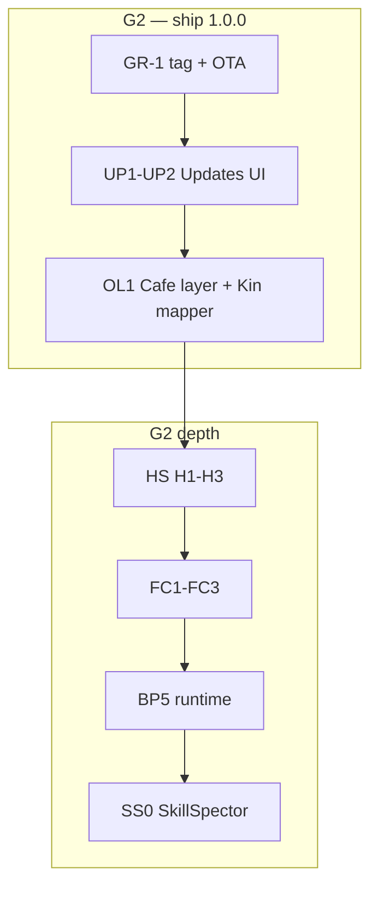

# CurXor OS — Current Roadmap (scoped · build-ready)

> **Room:** Current roadmap — **scoped items only** · hand off to Agent build chats from here  
> **Future ideas:** [FUTURE-ROADMAP.md](./FUTURE-ROADMAP.md) — capture · gate · promote when scoped  
> **Shipped history:** [DAY-ONE-BUILD-PLAN.md](./DAY-ONE-BUILD-PLAN.md) · [UNBOX-FIELD-LOG.md](./UNBOX-FIELD-LOG.md)  
> **Owner:** Ankur (priority) · CTO agent (sequence + handoffs)  
> **Last updated:** July 2026

---

## How to use this doc

1. **Only scoped work lives here** — status `scoped` or active program waves at **G1–G3**.
2. **One Agent build chat per sprint row** — copy the handoff block; mark `handed-off` when chat opens.
3. **New ideas** → [FUTURE-ROADMAP.md](./FUTURE-ROADMAP.md) first. When gated and scoped, **promote** into this doc.
4. **Don't duplicate shipped work** — BP0–BP4, Cafe C4–C13, Tier C sweep, Patron Ask CH0–CH5 are done.

---

## Build gates

| Gate | Meaning | Status |
|------|---------|--------|
| **G1** | On-device `qa-smoke` pass | ✓ **Green** · 2026-07-01 · MS-S1 |
| **G2** | **v1.0.0** tagged after G1 | ✓ **Green** · tag `v1.0.0` · box **866a3e5** · 2026-07-02 |
| **G3** | Appliance demo captures | **Current** — next after A01 doc |
| **G4** | Operator UAT smile | Tier C depth · rebrand · see [FUTURE-ROADMAP.md](./FUTURE-ROADMAP.md) |

---

## G2 build queue (ordered sprints)

One **Agent build chat per row**. Do not parallel programs that touch the same files (e.g. HS-H3 + Cafe sprite pass).

| # | Sprint ID | Program | Gate | P | Status |
|---|-----------|---------|------|---|--------|
| 1 | **GR-1** | Golden release | G2 | P0 | **Shipped** · `866a3e5` · tag `v1.0.0` · box verified |
| 2 | **UP1–UP2** | Update delivery | G2 | P0 | **Shipped** · release.yml · Settings **Updates** · box API smoke ✓ |
| 3 | **A01** | Golden path doc | G1 ✓ | P0 | **Next** — `01-installation.md` addendum |
| 4 | **D01–D04** | Flagship appliance | G1 ✓ | P1 | Work checklist · Capital paper smoke · Forge→Cafe audit on **10.0.0.1** |
| 5 | **PM1–PM2** | Appliance power | G2 | P2 | Settings restart stack · reboot/shutdown — [IDEA-A06](#idea-a06-settings--appliance-power-controls) |
| 6 | **OL1 + FF0** | OS layer fix | G2 | P1 | Cafe = Patron Hall · Engage → Creator · nav/FRE honest |
| 7 | **OL-Kin1** | Kin mapper | G2 | P1 | Kin universal · FRE decouple · “Household” nav |
| 8 | **HS-H1** | Inter-Claw | G2 | P1 | Five ● paths · triggers · `claw.handshake` emit |
| 9 | **HS-H2** | Inter-Claw | G2 | P1 | Discover coach · dismiss/snooze · no auto-nav |
| 10 | **HS-H3** | Inter-Claw | G2 | P1 | Cafe bro-hug · brightness · affinity XP · optional chime |
| 11 | **FC1–FC3** | Firecrawl | G2 | P1 | BYOK scrape worker · `web.scrape` tools · Build Plane MCP |
| 12 | **SS0** | SkillSpector | G2 | P1 | Static scan on Forge import · block high-risk skills |
| 13 | **BP5** | Build Plane | G2 | P1 | Real Cursor OAuth · live worker · delegation execution loop |
| 14 | **GK1–GK2** | Grok ecosystem | G2 | P2 | `xai` frontier provider · Grok vs Cursor decision doc |
| 15 | **BP6** | Delegation board | G2 | P2 | Kanban · `running` / `waiting_review` statuses |
| 16 | **BP7** | Build Spaces | G2 | P2 | One repo worktree · delegation ↔ space link |
| 17 | **GM0** | Gamer slot | G2 | P2 | Slot decision · `/my-game` stub · honest Tier C card |

**Next up:** row **#3 A01** · then **#4 D01–D04** before HS, FC, or BP5 depth.



---

## G3 queue (after v1.0.0 tag)

| Sprint | Program | Done when |
|--------|---------|-----------|
| **A04** | Appliance captures | Screenshot/video pack from box IP |
| **G11** | Loop homepage | Storefront hero + three-loop section |
| **G01 + G02** | Storefront truth | Real hardware hero · Ten Claws honest copy |
| **HS-H4** | Inter-Claw leverage | Top 10 paths · CCP publish + handoff fns |
| **FC4** | Firecrawl | Capital intel + Arbitrage AB6 |
| **FILM1–FILM2** | GTM film | Desk loop capture · drift montage |
| **MO0–MO1** | Patron Link | `/m` shell · QR pair · approvals confirm |
| **FF1** | Forge Fusion | `parentLineage` on forged-apps |
| **GK3–GK4** | Grok | Skill Pack schema · Chrome DevTools MCP note |
| **F12** | Activity timeline | Home recent-activity feed |
| **G12–G13** | Storefront | Trust loop graphic · `/for-builders` page |

---

## Active programs (G1–G3)

| Program | ID | P | Gate | Spec | Current waves |
|---------|-----|---|------|------|---------------|
| Golden release | **GR** / **UP** | P0 | G2 ✓ | [UPDATE-DELIVERY-ROADMAP.md](./UPDATE-DELIVERY-ROADMAP.md) | **UP1–UP2 shipped** · A03 · UP8 remain |
| Inter-Claw Handshakes | **HS** | P1 | G2→G3 | [INTER-CLAW-HANDSHAKES.md](./INTER-CLAW-HANDSHAKES.md) | H1–H4 |
| Firecrawl Web Context | **FC** | P1 | G2→G3 | [EXTERNAL-BRIDGES-ROADMAP.md](./EXTERNAL-BRIDGES-ROADMAP.md) | FC1–FC4 |
| Forge skill security | **SS** | P1 | G2 | § [IDEA-F14](#idea-f14-forge-skill-security--skillspector) | SS0–SS1 |
| Build Plane runtime | **BP5** | P1 | G2 | [BUILD-PLANE-CURSOR.md](./BUILD-PLANE-CURSOR.md) | B01–B05 |
| Build Plane board / Spaces | **BP6** · **BP7** | P2 | G2 | [BUILD-PLANE-CURSOR.md](./BUILD-PLANE-CURSOR.md) | BP6 · BP7 |
| OS layers + Forge Fusion | **OL** / **FF** | P1 | G2→G3 | [CAFE-OS-LAYER-MODEL.md](./CAFE-OS-LAYER-MODEL.md) | OL1 · FF0 · FF1 |
| Kin → mapper | **OL-Kin** | P1 | G2 | [CAFE-OS-LAYER-MODEL.md](./CAFE-OS-LAYER-MODEL.md) | OL-Kin1 |
| Grok ecosystem | **GK** | P2 | G2→G3 | [EXTERNAL-BRIDGES-ROADMAP.md](./EXTERNAL-BRIDGES-ROADMAP.md) | GK1–GK4 |
| Gamer Claw slot | **GM** | P2 | G2 | [GAMER-CLAW-VISION.md](./GAMER-CLAW-VISION.md) | GM0 only |
| Loop GTM | **GTM-LOOP** | P0/P1 | G3 | storefront `LOOP-POSITIONING.md` | G11–G12 |
| Patron Link | **MO** | P2 | G3 | [MOBILE-PATRON-LINK.md](./MOBILE-PATRON-LINK.md) | MO0–MO1 |
| Compute ladder copy | **HW** | P1 | G3 | [COMPUTE-LADDER.md](./COMPUTE-LADDER.md) | HW1 |

**Future-only (G4+):** SIG · MA-COS · VT-IN · ES · LR · TC · CL · AD · GM1+ · HS H5–H6 → [FUTURE-ROADMAP.md](./FUTURE-ROADMAP.md)

---

## Program UP — Update & patch delivery

**Status:** UP0 ✓ G1 · **UP1–UP2 ✓ shipped** 2026-07-02 (`866a3e5` · tag `v1.0.0`).

| Wave | Scope | Gate | Status |
|------|-------|------|--------|
| **UP1** | CI release · signed manifest · GitHub Release assets | G2 | **Shipped** |
| **UP2** | Settings **Updates** — Check / Install / log | G2 | **Shipped** |
| **UP8** | Factory USB = latest stable (IDEA-A03) | G2 | Pending |

**Spec:** [UPDATE-DELIVERY-ROADMAP.md](./UPDATE-DELIVERY-ROADMAP.md)

---

## Program HS — Inter-Claw Handshakes

**Status:** scoped · H1–H3 at G2 · H4 at G3 · H5+ → future doc.

| Wave | Scope | Gate | Done when |
|------|-------|------|-----------|
| **H1** | Path registry + 5 ● paths | G2 | `handshake-paths.ts` + triggers fire |
| **H2** | Discover UI — coach + dismiss/snooze | G2 | Capital→Creator nudge; no auto-nav |
| **H3** | Cafe ceremony — bro-hug · brightness · XP · chime | G2 | `claw.handshake` animates in pixel room |
| **H4** | Leverage payloads — top 10 paths | G3 | Creator pre-fill from Capital intel |

**H1 launch paths:** `fintwit_influencer` (Cap→Cre) · `inbound_to_pipeline` (Cre→Work) · `brand_from_outbound` (Work→Cre) · `household_health` (Vital→Kin) · `mint_handshake` (Forge→parent)

**Handoff (H1):**

```
Sprint: HS-H1 Inter-Claw path registry
Goal: Five ● handshake paths fire Discover/Leverage + emit claw.handshake
Done when: qa:local + manual Capital→Creator nudge + Cafe celebrate hook
@ docs/curxor-os/INTER-CLAW-HANDSHAKES.md
@ pillar-4-dashboard/lib/claw-mesh-protocol.ts
@ pillar-4-dashboard/lib/work-handoff.ts
Out of scope: H3 animation polish, Tier C live bridges, full matrix
```

---

## Program FC — Firecrawl

**First ship:** **FC-UC-01** Work lead enrichment — not Arbitrage-only.

| Wave | Scope | Gate |
|------|-------|------|
| **FC1** | `digital.env` key · `FirecrawlScrapeWorker` · receipt SSE | G2 |
| **FC2** | Engine tools + FC-UC-01 → `work-lead-enrichment.ts` | G2 |
| **FC3** | Outbound MCP · FC-UC-03 Creator URL seed | G2 |
| **FC4** | FC-UC-02 Capital intel + FC-UC-04 Arbitrage AB6 | G3 |

**Spec:** [EXTERNAL-BRIDGES-ROADMAP.md](./EXTERNAL-BRIDGES-ROADMAP.md)

---

## Program BP — Build Plane (BP5–BP7)

BP0–BP4 **shipped** (v0.9.1). **BP5+ = runtime on proven hardware.**

| Wave | Scope | Gate |
|------|-------|------|
| **B01–B05** | OAuth · live worker · delegation loop · write MCP · Automations webhook | G2 |
| **BP6** | Kanban · `running` / `waiting_review` | G2 |
| **BP7** | Build Spaces — worktree + shared context | G2 |

**Handoff (BP6):**

```
Sprint: BP6 Delegation board UI
Goal: Kanban over build-delegation-queue + running/waiting_review statuses
Done when: qa:local + manual resolve + MO approval preview stub
@ pillar-4-dashboard/lib/build-delegation-queue.ts
@ pillar-4-dashboard/components/settings/BuildPlanePanel.tsx
Out of scope: Live Cursor execution (B03), MA-COS patron board
```

---

## Program OL / FF / OL-Kin

| Wave | Scope | Gate |
|------|-------|------|
| **OL1 + FF0** | Cafe = Patron Hall · Engage → Creator · nav honest | G2 |
| **OL-Kin1** | Kin universal mapper · FRE decouple · “Household” nav | G2 |
| **FF1** | `parentLineage` on forged-apps | G3 |

**Spec:** [CAFE-OS-LAYER-MODEL.md](./CAFE-OS-LAYER-MODEL.md) · pairs [IDEA-G02](#idea-g02-ten-claws-honest-copy-audit) · [IDEA-G05](#idea-g05-engage--creator-merge--cafe-layer-fix-program-ol)

---

## Program SS — SkillSpector

| Wave | Scope | Gate |
|------|-------|------|
| **SS0** | Static scan on Forge import · block high-risk skills | G2 |
| **SS1** | CI gate on repo `skills/**` | G2 |

**Handoff (SS0):**

```
Sprint: SS0 SkillSpector on Forge import
Goal: Static scan (--no-llm) blocks high-risk skills before agent-workspace write
Done when: qa:local + malicious fixture rejected · Settings shows scan result
@ docs/curxor-os/CURRENT-ROADMAP.md § IDEA-F14
@ pillar-4-dashboard/app/api/claw/import/route.ts
Out of scope: SS1 CI, semantic LLM scan, marketplace UI
```

---

## Program GK — Grok (current waves only)

| Wave | Scope | Gate |
|------|-------|------|
| **GK1** | `xai` in `frontier-providers.ts` | G2 |
| **GK2** | Grok vs Cursor vs Build Plane docs | G2 |
| **GK3–GK4** | Skill Pack schema · Chrome DevTools MCP note | G3 |

---

## Shipped on this track (do not re-build)

| Item | Version / date |
|------|----------------|
| Build Plane BP0–BP4 | v0.8.0–v0.9.1 |
| Claw Cafe C4–C13 | dev / box |
| Tier C honesty sweep | v0.3.10 |
| Patron Ask CH0–CH5 | Jun 2026 |
| OTA script foundation | `ota-updater.sh` |
| UP0 OTA smoke | G1 ✓ |
| **GR-1 golden release** | **v1.0.0** · tag `v1.0.0` · 2026-07-02 |
| **UP1–UP2 Updates UI** | `866a3e5` · Settings → Updates · `/api/system/updates` |

---

## Scoped ideas (G1–G3)

### Hardware & golden path

#### [IDEA-A01] Golden path addendum
- **Gate:** G1 ✓ · **P0** · **Status:** scoped (doc pass)
- **Outcome:** Real NIC names, ROCm notes in `01-installation.md` from [UNBOX-FIELD-LOG.md](./UNBOX-FIELD-LOG.md).

#### [IDEA-A02] v1.0.0 + OTA manifest
- **Gate:** G2 ✓ · **P0** · Program **UP1**
- **Outcome:** Signed OTA · `version.json` → 1.0.0 stable.
- **Status:** **shipped** (2026-07-02)

#### [IDEA-A03] Factory USB golden image
- **Gate:** G2 · **P1** · Program **UP8**

#### [IDEA-A06] Settings — appliance power controls
- **Gate:** G2 · **P2** · Waves **PM1–PM2** (PM0 doc ✓)
- **Outcome:** Settings → System → Restart CurXor / reboot / shutdown with confirm + audit.

### Build Plane

#### [IDEA-B06] Delegation board · Program **BP6**
- **Gate:** G2 · **P2** · **Status:** scoped

#### [IDEA-B07] Build Spaces · Program **BP7**
- **Gate:** G2 · **P2** · **Status:** scoped

> B01–B05 tracked under Program **BP5** — see [BUILD-PLANE-CURSOR.md](./BUILD-PLANE-CURSOR.md).

### Claw Cafe & Master AI

#### [IDEA-C05] Inter-Claw Handshakes · Program **HS**
- **Gate:** G2 (H1–H3) · G3 (H4) · **P1** · **Status:** scoped

#### [IDEA-C08] Patron Ask · Program **CH**
- **Status:** **shipped** (CH0–CH5)

### Flagship claws (G1 appliance pass)

#### [IDEA-D01–D04] Work · Capital · Creator · Forge on box
- **Gate:** G1 ✓ · **P1** · Sprint row **D01–D04**

### OS shell & infra

#### [IDEA-F04] Firecrawl · Program **FC** · scoped · G2–G3
#### [IDEA-F05] Grok · Program **GK** · scoped · G2–G3
#### [IDEA-F12] Operator activity timeline · scoped · G2 (ship G3 queue OK)
#### [IDEA-F14] SkillSpector · Program **SS** · scoped · G2

> F01–F03 · F13 · B08 — captured G2 polish; slot after P1 queue or promote from future doc.

### GTM (current)

#### [IDEA-G02] Ten Claws honest copy audit
- **Gate:** G2 (with OL1) · **P1** · **Status:** scoped

#### [IDEA-G05] Engage → Creator merge · Program **OL**
- **Gate:** G2 (OL1) · **P1** · **Status:** scoped

#### [IDEA-G08] Kin → universal mapper · Program **OL-Kin**
- **Gate:** G2 · **P1** · **Status:** scoped

#### [IDEA-G11] Loop positioning UI
- **Gate:** G3 · **P0/P1** · **Status:** scoped (copy doc shipped)

#### [IDEA-G12] Trust loop graphic · scoped · G3
#### [IDEA-G13] `/for-builders` page · scoped · G3+

---

## Build chat handoff template

```
Sprint: [ID from G2/G3 queue]
Goal: [one sentence]
Done when: [qa command + visible outcome on box if applicable]
@ docs/curxor-os/CURRENT-ROADMAP.md
@ [spec doc]
@ [files]
Out of scope: [explicit]
```

---

## Changelog

| Date | Change |
|------|--------|
| Jul 2026 | **GR-1 + UP1–UP2 shipped** — v1.0.0 · box deploy · Updates tab smoke |
| Jul 2026 | Split from FUTURE-ROADMAP · G2 build queue |

---

## References

- Future (G4+): [FUTURE-ROADMAP.md](./FUTURE-ROADMAP.md)
- Shipped sequencing: [DAY-ONE-BUILD-PLAN.md](./DAY-ONE-BUILD-PLAN.md)
- Box ops: [UNBOX-FIELD-LOG.md](./UNBOX-FIELD-LOG.md) · [FOUNDER-COCKPIT.md](./FOUNDER-COCKPIT.md)
- Inter-Claw: [INTER-CLAW-HANDSHAKES.md](./INTER-CLAW-HANDSHAKES.md)
- External bridges: [EXTERNAL-BRIDGES-ROADMAP.md](./EXTERNAL-BRIDGES-ROADMAP.md)
- OTA: [UPDATE-DELIVERY-ROADMAP.md](./UPDATE-DELIVERY-ROADMAP.md)
