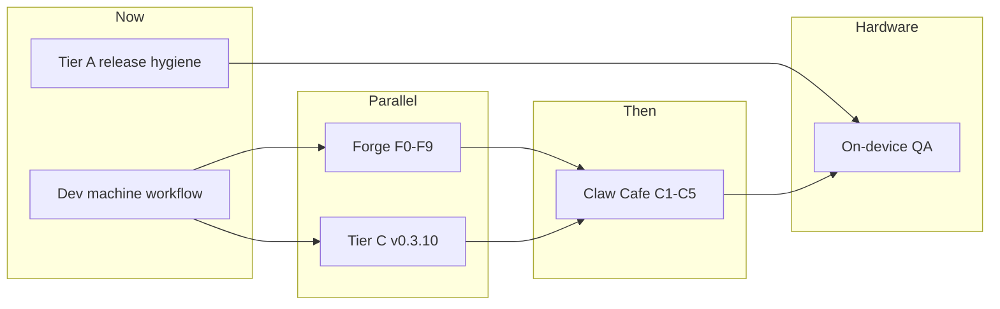

# CurXor OS — Day-One Build Plan (revised)

> **Status:** Active · hardware in limbo · build mode on dev machine  
> **Owner:** Ankur (vision) + CTO agent (architecture / sequencing)  
> **Last updated:** June 2026

## Summary

Day-one is no longer “freeze until the box arrives.” We ship **honest software** on the **dev machine** now; the appliance gets a **known-good rsync/install** when hardware lands — not a blind ISO flash into unknown vendor state.

Three pillars:

1. **Dev-first** — iterate on the new machine; reconcile to MS-S1 MAX at arrival.
2. **Claw Cafe next** — cross-app progression and habit layer (differentiator + future rebrand north star).
3. **Canvas claws = Coming Soon** — light shells, no fake depth.

---

## CTO verdict on your three calls

| Decision | Verdict |
|----------|---------|
| Build on new machine, not ISO-first | **Yes.** Unknown factory image = unknown ROCm, eno mapping, and drift. Dev machine is the source of truth until we run `install-all.sh` on real hardware once. |
| Claw Cafe as next deep build | **Yes, with guardrail.** Cafe is the moat competitors cannot copy quickly. Do not let it replace exit-demo polish on Work / Creator / Capital — those are what $3,999 buyers touch first. |
| Light builds + Coming Soon on the rest | **Strong yes.** Honest labels beat demo theater. Five full fake products would destroy trust. |

---

## Build environment strategy

### Now (hardware limbo)

```
┌─────────────────────────────────────────────────────────────┐
│  Dev machine (new box)                                      │
│  · pillar-4-dashboard npm run dev                           │
│  · CURXOR_*_PATH → scripts/dev-qa/* fixtures                │
│  · qa:local green before every milestone                    │
│  · Git = single source of truth                             │
└─────────────────────────────────────────────────────────────┘
                              │
                              │  when MS-S1 MAX arrives
                              ▼
┌─────────────────────────────────────────────────────────────┐
│  Appliance reconciliation (one-time)                        │
│  1. BIOS UMA max · label eno1/eno2                          │
│  2. Ubuntu 24.04 minimal (or audit vendor image — see below)│
│  3. rsync curxor-os → /opt/curxor/                          │
│  4. install-all.sh · deploy.sh --pull-models                │
│  5. Diff: dev QA vs on-device QA · file issues              │
└─────────────────────────────────────────────────────────────┘
```

### Unknown box software — how we handle it

When hardware arrives, **do not assume** the image matches our docs. First session together:

1. **Inventory** — `ubuntu`, kernel, ROCm, Docker, NIC names, disk layout.
2. **Choose path A or B:**
   - **A — Clean install (preferred):** Ubuntu 24.04 minimal → our `install-all.sh`. Predictable.
   - **B — Vendor image audit:** If MS-S1 ships with preloaded OS, document deltas; only keep what helps (drivers). Overlay `/opt/curxor` from repo.
3. **Golden path doc** — capture what actually worked in `docs/guides/01-installation.md` addendum.
4. **Freeze** — tag release + OTA manifest only after on-device smoke passes.

You need a CTO in the room for step 1–2. That is not optional for a $3,999 appliance claim.

---

## App tiers (day-one scope)

### Tier A — Flagship (ship-quality, demo-ready)

Maintain and release-hygiene only unless blocking GTM.

| App | Route | Day-one bar |
|-----|-------|-------------|
| The Forge | `/claw-forge` | Mint flow + wizard · **best-in-class arc** — [BEST-IN-CLASS-BUILD-PLAN.md](../forge/BEST-IN-CLASS-BUILD-PLAN.md) |
| Capital Claw | `/my-capital` | Go Live + paper/live Alpaca path |
| Creator Claw | `/my-content` | Wizard + Go Live + engage loop |
| Outreach Claw | `/my-work` | Persona levels L1–L3 + deliverability story |

**Tier A rule:** push tags, demo captures, exit-demo scripts — no new excellence arcs until Cafe MVP lands unless a buyer-blocking bug appears.

### Tier B — Claw Cafe (next deep build)

**Product intent:** OS-wide growth layer — XP, streaks, level-ups, cross-Claw bonuses, social/habit home. Not just the physical “Engage Desk” arcade demo.

**Naming note:** Today `claw-cafe` route = **Engage Claw** (vision lanes + Work XP panel stub). Cafe build likely ** reframes** this route into the gamification hub; Engage/DM features may become a tab or merge with Creator engage loop later.

**MVP definition (Cafe v1):**

| Capability | Description |
|------------|-------------|
| **Growth home** | Single place to see L1–L5 persona, progress, next nudge |
| **XP ledger** | Cross-app events (work send, creator publish, capital rule, tour complete) |
| **Level-up UX** | Celebration + optional opt-out (respect sovereignty) |
| **Streaks & badges** | Per-Claw vertical badges; weekly cross-Claw bonus |
| **Coach bridge** | Surfaces `experience-coach-catalog` nudges tied to level |
| **Honest scope** | Cafe v1 reads real events from Tier A apps; no fake leaderboard |

**Existing hooks to wire:**

- `docs/curxor-os/GROWTH-LEVEL-FRAMEWORK.md` — L1–L5 labels
- `lib/os-growth-level.ts` — shared mechanics
- `/api/work/xp` + `WorkCafeXpPanel` — first vertical XP
- `WorkCafeXpPanel` pattern → generalize to `lib/claw-cafe-xp.ts`

**Suggested build waves (hand to Agent chats):**

| Wave | Scope |
|------|--------|
| **C0 — Spec** | Cafe PRD: screens, event schema, rename Engage vs Cafe, rebrand timing |
| **C1 — Shell** | Cafe home layout, nav badge, growth level display |
| **C2 — Event bus** | `growthXp` ingest from Work, Creator, Capital stores |
| **C3 — Progression** | Level-up rules, nudges, opt-out, settings |
| **C4 — Delight** | Streaks, badges, celebration UI |
| **C5 — QA + GTM** | `qa-cafe.mjs`, demo capture, storefront copy |

Target version band: **v0.4.x** (Cafe arc).

### Tier C — Canvas claws (Coming Soon)

Light shell only. Operator sees **what is coming**, not a fake production desk.

| App | Route | Light build |
|-----|-------|-------------|
| Arbitrage Claw | `/my-shop` | **Frozen Tier C** — hero + live desk showcase + commerce read bridges · [FREEZE.md](../arbitrage-claw/FREEZE.md) |
| Signal Claw | `/optimus` | **Frozen Tier C** — Humanoid Home Hub preview · [FREEZE.md](../signal-claw/FREEZE.md) |
| Swarm Claw | `/robotaxi` | **Frozen Tier C** — grid dispatch + Robotaxi horizon · [FREEZE.md](../swarm-claw/FREEZE.md) |
| Vital Claw | `/my-vital` | **Frozen Tier C** — Lab live + honest bridges · [FREEZE.md](../vital-claw/FREEZE.md) |
| Kin Claw | `/my-family` | **Frozen Tier C** — household identity showcase (Optimus + Vital story), demo fixture, CCP sync · [FREEZE.md](../kin-claw/FREEZE.md) |

**Coming Soon UX contract (all Tier C):**

- Persistent **Coming Soon** badge in app header + sidebar
- FRE: shortened — “Preview mode” copy, no false Go Live
- Agent chat: honest system prompt (“preview module, not production”)
- No mock pipelines that imply live Shopify/Alpaca/fleet APIs
- Optional: “Notify me when live” → local flag or waitlist stub

Target version band: **v0.3.10** (single sweep across Tier C) — can run parallel to Cafe C0/C1 if files do not overlap.

---

## Phased roadmap



### Phase 0 — Dev baseline (this week)

- [ ] Confirm dev machine QA green (`npm run qa:local`)
- [ ] Push/tag Tier A milestone if pending (e.g. v0.3.9)
- [x] **Tier C Coming Soon** sweep (parallel with Forge) · Cafe waits until Forge + Tier C land

### Phase 1 — Tier C honesty sweep (before Cafe) · **v0.3.10 complete**

**Run in parallel with Forge Agent chat** — no file overlap.

- [x] Shared `PreviewModuleBanner` + `ComingSoonBadge` + preview-mode FRE contract (`claw-preview-apps.ts`)
- [x] Per-app hero panels (Arbitrage, Signal, Swarm) — honest preview copy, no false pipelines
- [x] Vital — Lab + go-live checklist live; bridges labeled preview until eno2 · [FREEZE.md](../vital-claw/FREEZE.md)
- [x] Kin — identity showcase, demo household, Vital/Signal cross-links, `06-kin-claw.png` · [FREEZE.md](../kin-claw/FREEZE.md)
- [x] Signal — Humanoid Home Hub five-tab preview · [FREEZE.md](../signal-claw/FREEZE.md)
- [x] Arbitrage + Swarm frozen · [FREEZE.md](../arbitrage-claw/FREEZE.md) · [FREEZE.md](../swarm-claw/FREEZE.md)
- [x] Agent catalog + assist copy audit — `previewAgentPromptBlock` on all Tier C apps
- [x] QA: `verify:tier-c-sweep` + kin/vital levels in `qa:local`
- [x] Target: **v0.3.10**

### Phase 2 — Claw Cafe (after Forge + Tier C)

- [ ] C0 spec locked in [CLAW-CAFE-PRD.md](./CLAW-CAFE-PRD.md)
- [ ] C1–C4 implementation waves (Forge mint events from F8 should land first)
- [ ] Update `GROWTH-LEVEL-FRAMEWORK.md` — Cafe priority P0

### Phase 3 — Hardware reconciliation (trigger: box in hand)

- [ ] Joint inventory session
- [ ] Clean install or audited overlay
- [ ] On-device `qa:local` + inference verify
- [ ] Demo re-capture on appliance IP
- [ ] Golden image + OTA freeze

### Phase 4 — Build Plane foundation (BP0) · **v0.8.0-prep** · **Shipped**

### Phase 4b — Build Plane inbound MCP (BP1) · **v0.8.1** · **Shipped**

| Item | Scope |
|------|--------|
| **`GET/POST /api/build/mcp`** | JSON-RPC MCP server on LAN (tools/list, tools/call, initialize) |
| **Read tools** | `get_build_status`, `get_ccp_summary`, `get_cafe_snapshot`, `get_forge_fleet`, `get_desk_status` |
| **Bridge read policy** | `build-plane-bridge-policy.ts` · CCP scopes · `allowWriteTools` gate for future writes |
| **Network path tags** | `network-path.ts` · operate / build / egress · outbound MCP client respects `buildPlane.enabled` |
| **Settings panel** | MCP connect URL + BP1 copy in `BuildPlanePanel` |

**Deferred (post-BP3):** ~~Master AI delegation queue UI (v0.9+)~~ **Shipped (BP4 v0.9.1)** · Real Cursor OAuth (v0.10+).

### Phase 4c — Build Plane OS event bus (BP2) · **v0.8.2** · **Shipped**

| Item | Scope |
|------|--------|
| **`emitOsEvent()`** | Central bus → Cafe ingest + signed outbound webhook |
| **Event kinds** | `forge.claw_minted`, `go_live.failed`, `ota.available`, `eno2.down` |
| **`GET/POST /api/build/events`** | Event log read · `poll` (OTA/eno2) · `emit_demo` for QA |
| **Go Live hooks** | Capital/Work/Creator/Cafe/Swarm/Vital `go_live` actions emit on failure |
| **Settings** | Webhook URL + signing secret in Build Plane panel |

### Phase 4d — Build Plane remote worker wizard (BP3) · **v0.9.0** · **Shipped**

| Item | Scope |
|------|--------|
| **`GET/POST /api/build/worker`** | 6-step wizard · SSH host config · TCP probe · demo mark-online |
| **Settings UI** | `BuildPlaneWorkerWizard` in Build Plane panel |
| **Delegation queue** | `build-delegation-queue.json` · enqueue/resolve API scaffold |
| **Schema** | `workerHost`, `workerSshPort`, `workerSshUser`, `workerCompletedSteps` on `buildPlane` |

### Phase 4e — Master AI delegation queue (BP4) · **v0.9.1** · **Shipped**

| Item | Scope |
|------|--------|
| **`GET/POST /api/build/delegation`** | G5 suggest · G6 enqueue · approve/reject/complete with ascension gates |
| **Settings UI** | `BuildPlaneDelegationQueue` in Build Plane panel |
| **Cafe chamber** | Master AI flyout · suggest build task → confirm in Settings |
| **Policy** | `build-delegation-policy.ts` · `allowDelegation` + ascension tier |

---

## Day-one GTM truth table (what we say vs what ships)

| Claim | Allowed when |
|-------|----------------|
| “Four flagship Claws + Forge, production-grade demo” | Tier A exit-demo green |
| “Claw Cafe — habit & progression across your Claws” | Cafe C3+ with real XP events |
| “Ten Claws” | Always — with five clearly marked **Coming Soon** |
| “Arbitrage live desk preview” | Tier C frozen · `activate_desk_showcase` or mock env · not flagship |
| “Sovereign appliance, local LLM” | Hardware validation complete |
| “Unplug eno2, outbound stops” | Verified on appliance |

---

## What not to do

- Flash unknown ISO on MS-S1 before inventory
- Deep-build Arbitrage/Signal/Swarm while Cafe is undefined
- Hide Tier C mock data behind production UI patterns
- Rebrand to “Claw Cafe” before Cafe MVP + flagship demos are GTM-ready

---

## Build chat handoff template

When opening an Agent chat:

```
Sprint: [C1 Cafe shell | Tier C sweep | v0.3.9 push]
Goal: [one sentence]
Done when: [QA command + visible outcome]
@ docs/curxor-os/DAY-ONE-BUILD-PLAN.md
@ [specific files]
Out of scope: [Tier A excellence, hardware install, storefront]
```

---

## References

- Growth framework: [GROWTH-LEVEL-FRAMEWORK.md](./GROWTH-LEVEL-FRAMEWORK.md)
- Founder overnight audit: [FOUNDER-OVERNIGHT-AUDIT.md](./FOUNDER-OVERNIGHT-AUDIT.md)
- Hardware readiness: [HW-READINESS-CHECKLIST.md](./HW-READINESS-CHECKLIST.md)
- Build Plane vision: [BUILD-PLANE-CURSOR.md](./BUILD-PLANE-CURSOR.md)
- Holding pattern (superseded for build): [../HOLDING-PATTERN.md](../HOLDING-PATTERN.md)
- Work XP stub: `pillar-4-dashboard/components/apps/work/WorkCafeXpPanel.tsx`
- OOTB catalog: `pillar-4-dashboard/lib/ootb-apps.ts`
