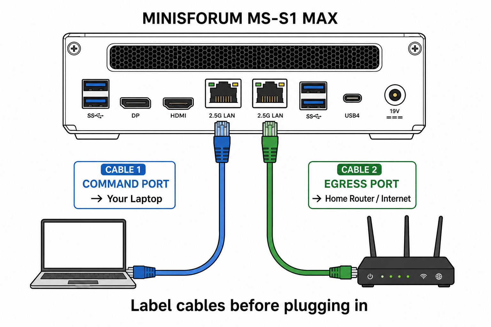

# CurXor MS-S1 MAX — Printable Unbox Guide

> **For:** Ankur (first-time setup)  
> **When:** Unbox day — **now**  
> **Your hardware:** MINISFORUM MS-S1 MAX · Ryzen AI Max+ 395 · **64 GB RAM** · 2 TB SSD · **Standard tier ($3,999)**  
> **Software version:** 0.9.1 (pre-unbox gate **PASS** on laptop)  
> **CTO agent:** Ask step-by-step in a Cursor **build chat** anytime — that's expected.

**Print this document.** Check boxes with a pen as you go.

---

## Today's timeline (plan 3–4 hours active + model download)

| Block | Time | What |
|-------|------|------|
| **0** | 15 min | Unbox · power · monitor · keyboard |
| **1** | 15 min | BIOS — UMA **Maximum** (~48 GB on your 64 GB SKU) |
| **2** | 60–90 min | Ubuntu 24.04 from USB |
| **3** | 30–60 min | Copy `curxor-os` → `install-all.sh` |
| **4** | 30–45 min | `deploy.sh --pull-models` (64 GB — two models) |
| **5** | 15 min | Cables · network scripts · `verify-unbox-day.sh` |
| **6** | 30 min | Browser · FRE · flagship smile test |

**Rule for today:** No new features. No version bump until on-device smoke passes.

---

## What you are doing (in plain English)

You are turning a **MINISFORUM MS-S1 MAX** into your **CurXor** box — a sovereign appliance that runs your AI "Claws" locally on your metal, not in the cloud.

**Today is NOT about building new features.** It is about:

1. Unboxing and plugging in cables correctly  
2. Installing Ubuntu + CurXor software (one-time)  
3. Opening the dashboard in your browser  
4. Confirming it "feels real" — setup works, Claws open, Cafe loads  

**First boot will feel like a powerful dev kit becoming an appliance** — not a polished iPhone. That is normal.

**Your SKU (64 GB):** BIOS UMA → **~48 GB** GPU heap. **Do not** use the Pro 128 env profile. See [MS-S1-128GB-UNBOX-CHEATSHEET.md](./MS-S1-128GB-UNBOX-CHEATSHEET.md) only if you had the 128 GB SKU.

---

## Before you start — shopping list

| Item | Why you need it |
|------|-----------------|
| ☐ Your **laptop** (Windows) | Control the box · copy software from `C:\Users\ankur\curxor-os` |
| ☐ **2 Ethernet cables** (Cat5e/Cat6) | One to laptop, one to internet router |
| ☐ **Masking tape + pen** | Label cables **COMMAND** and **EGRESS** |
| ☐ **Monitor + keyboard** | BIOS + Ubuntu install (~first 2 hours) |
| ☐ **USB stick** with **Ubuntu 24.04** installer | Clean install (recommended) |
| ☐ This printed guide | Your walkthrough |
| ☐ Phone camera | Photo cable layout |

**Optional:** USB hub · HDMI cable · USB-to-Ethernet adapter if laptop has no Ethernet port.

**You do NOT need today:** API keys · Alpaca · email SMTP · social keys. Demo mode is honest and correct.

---

## The two cables — where do they go?

### The idea (read this once)

The MS-S1 has **two network ports** on the back.

| Cable label | CurXor name | Plugs into | Goes to | What it does |
|-------------|-------------|------------|---------|--------------|
| **COMMAND** | eno1 | One port on MS-S1 | **Your laptop** (direct or via router) | Dashboard — your control panel |
| **EGRESS** | eno2 | The **other** port | **Home router** (internet) | Outbound trades, posts, scrapers — **unplug to stop outbound AI** |

**Label cables with tape before you plug in.** After install we confirm which physical port is eno1 vs eno2 with one command. Swapped cables are fixable — not a disaster.

### Picture — cable layout



### ASCII diagram (if image does not print)

```
                    YOUR HOME
    ┌──────────────────────────────────────────────┐
    │   [ Laptop ]                                 │
    │       │  COMMAND cable                       │
    │       ▼                                      │
    │   ┌─────────────┐         EGRESS cable      │
    │   │  MS-S1 MAX  │───────────────────────────┼──► [ Router ] ──► Internet
    │   │  (CurXor)   │                            │
    │   └─────────────┘                            │
    │     Port A          Port B                     │
    └──────────────────────────────────────────────┘
```

### Step-by-step — plugging in cables

**Do this AFTER Ubuntu + CurXor install** (Part 4). For now, just understand the plan.

1. ☐ Tape **COMMAND** on one cable, **EGRESS** on the other.  
2. ☐ **EGRESS:** MS-S1 port → **router**.  
3. ☐ **COMMAND:** MS-S1 other port → **laptop Ethernet** (or same router + Wi‑Fi on laptop).  
4. ☐ Photo which cable is in which port.  
5. ☐ After Part 4, run `ip link show eno1` / `eno2` to confirm. Swap cables if needed.

**Never swap these mentally:** Command = you. Egress = internet/outbound.

---

## Words you will see (simple glossary)

| Word | Plain meaning |
|------|----------------|
| **BIOS** | Settings menu at power-on (keyboard, not mouse) |
| **Ubuntu** | Operating system CurXor runs on |
| **Dashboard / Flight Command** | CurXor UI in browser — port **3080** |
| **FRE** | First-run setup wizard — pick your Claws |
| **Claw** | One AI app (Work, Capital, Creator, Forge, …) |
| **eno1 / Command Port** | Network port for **you** |
| **eno2 / Egress Port** | Network port for **outbound AI** |
| **Ollama** | Local LLM on the box (model download takes time first run) |
| **Demo mode** | Works without API keys — honest labels |

---

## Part 1 — Unbox + BIOS (30 minutes)

### Step 1.1 — Open the box

1. ☐ MS-S1 on desk with **good airflow** (not in a closed cabinet).  
2. ☐ **Power cable** — hold off on Ethernet if installing Ubuntu from USB.  
3. ☐ **Monitor + keyboard** connected.  
4. ☐ **2 TB SSD** is internal — nothing to install for storage.

### Step 1.2 — BIOS (15 minutes)

Sets GPU memory so local AI can run.

1. ☐ Power on MS-S1.  
2. ☐ Press **Delete** or **F2** repeatedly → BIOS screen.  
3. ☐ **Advanced → AMD CBS → NBIO → UMA Frame Buffer** (or GPU Memory / iGPU).  
4. ☐ Set to **Maximum** — on **your 64 GB unit, expect ~48 GB** (not 96 GB).  
5. ☐ **iGPU** → **Enabled**.  
6. ☐ **Secure Boot** → **Disabled** (first deploy).  
7. ☐ **F10** → Save and Exit.

**Stuck in BIOS?** Photo the screen → Cursor build chat.

---

## Part 2 — Install Ubuntu (60–90 minutes)

**Recommended:** Clean **Ubuntu 24.04 LTS** from USB (not vendor pre-load unless you audit it).

### Step 2.1 — Boot from USB

1. ☐ Insert Ubuntu USB.  
2. ☐ Reboot → **F11** / **F12** / **Esc** → boot menu → USB.  
3. ☐ **Install Ubuntu** (minimal if offered).  
4. ☐ Disk: **Erase disk and install** (dedicated CurXor box).  
5. ☐ Create user + password — **remember them**.  
6. ☐ Finish install → reboot → remove USB.

### Step 2.2 — First login

1. ☐ Ubuntu desktop on MS-S1.  
2. ☐ Open **Terminal**.  
3. ☐ Prompt looks like `username@hostname:~$`

**Optional — enable SSH** (so laptop can deploy without monitor later):

```bash
sudo apt-get update && sudo apt-get install -y openssh-server
sudo systemctl enable --now ssh
ip addr | grep "inet "
```

Note the IP (e.g. `192.168.1.x`) — that's **BOX_IP** for browser URLs. On the laptop, add **`Host curxor`** to `~/.ssh/config` so deploy uses **`ssh curxor`** (see [FOUNDER-COCKPIT.md](./FOUNDER-COCKPIT.md) §3b).

---

## Part 3 — Copy CurXor onto the box (30–60 min install)

Source on laptop: `C:\Users\ankur\curxor-os` · target on box: `/opt/curxor/`

### Option A — USB copy (no network between laptop and box)

**Laptop:** Copy whole `curxor-os` folder to USB.

**MS-S1:**

```bash
sudo mkdir -p /opt/curxor
sudo cp -a /media/$USER/*/curxor-os/* /opt/curxor/
```

### Option B — Network copy from laptop (recommended if SSH works)

**Laptop PowerShell** — one-shot deploy (rsync + post-update + restart):

```powershell
cd C:\Users\ankur\curxor-os
.\scripts\deploy-to-box.ps1
```

Legacy IP form: `.\scripts\deploy-to-box.ps1 -BoxIp BOX_IP -BoxUser YOUR_UBUNTU_USER`

**Or manual SCP:**

```powershell
scp -r C:\Users\ankur\curxor-os curxor:/tmp/curxor-os
```

**MS-S1:**

```bash
sudo rsync -a /tmp/curxor-os/ /opt/curxor/
```

### Step 3.1 — Run the installer

On MS-S1 — **one line at a time**:

```bash
sudo chmod +x /opt/curxor/scripts/*.sh
sudo chmod +x /opt/curxor/pillar-*/scripts/*.sh
sudo bash /opt/curxor/scripts/install-all.sh
```

☐ **30–60 minutes.** Success messages, not red errors.

### Step 3.2 — Download AI models

**Standard 64 GB (your box):** skip Pro 128 profile — go straight to pull:

```bash
sudo /opt/curxor/pillar-1-compute/scripts/deploy.sh --pull-models
```

**Pro 128 only** — before pull:

```bash
sudo cp /opt/curxor/pillar-1-compute/config/compute.env.pro128.example /etc/curxor/compute.env
sudo ln -sfn /etc/curxor/compute.env /opt/curxor/pillar-1-compute/.env
sudo /opt/curxor/pillar-1-compute/scripts/deploy.sh --pull-models
```

| SKU | Models pulled | Typical download time |
|-----|---------------|------------------------|
| **Standard 64** (you) | `moondream:1.8b` · `qwen3:8b` | **30–45 min** |
| **Pro 128** | above + `qwen3-vl:8b` · `qwen3:14b` · `batiai/qwen3.6-35b:q4` | 45–90 min |

Verify Ollama:

```bash
curl -s http://127.0.0.1:11434/api/tags
```

☐ JSON with model names = good.

---

## Part 4 — Cables + network + verify (15 minutes)

Plug in **EGRESS** (router) and **COMMAND** (laptop or router) — see cable section.

```bash
sudo /opt/curxor/scripts/setup-captive-portal.sh
sudo /opt/curxor/scripts/setup-mesh-network.sh
```

### Confirm ports

```bash
ip link show eno1
ip link show eno2
```

If missing, list all: `ip link | grep -E '^[0-9]+:'` — photo → CTO.

### Unbox verification

```bash
sudo chmod +x /opt/curxor/scripts/verify-unbox-day.sh
sudo /opt/curxor/scripts/verify-unbox-day.sh --post-models
```

☐ **[PASS]** = good · **[WARN]** = often OK day one · **[FAIL]** = stop, paste output in build chat.  
☐ Copy **GOLDEN PATH NOTES** from script output — save for docs.

---

## Part 5 — Dashboard + smile test (30 minutes)

### Step 5.1 — Health check

On MS-S1:

```bash
curl -s http://127.0.0.1:3080/api/setup/status
systemctl is-active curxor-dashboard
```

**Laptop browser** — try:

| URL | When |
|-----|------|
| `http://10.0.0.1:3080` | COMMAND cable direct to laptop |
| `http://BOX_IP:3080` | Same router as laptop |

Find IP on box: `ip addr | grep "inet "`

### Optional — browser on the box itself

Not required today; laptop-on-Command-Port is the default path.

```bash
sudo apt update && sudo apt install -y firefox
# Open http://127.0.0.1:3080 on the MS-S1 monitor
```

### Step 5.2 — FRE (`/setup`)

1. ☐ Welcome → through.  
2. ☐ Pick modules — at minimum: **Forge · Capital · Creator · Work**.  
3. ☐ Finish provisioning → land on **Home**.

### Step 5.3 — Flagship click-through (~5 min each)

| Route | OK if… |
|-------|--------|
| `/claw-forge` | Mint / Fleet tabs load |
| `/my-work` | Desk loads · demo labels without email keys |
| `/my-content` | Creator desk · wizard opens |
| `/my-capital` | Paper/demo trading |
| `/claw-cafe` | Ascension → Sync → pixel room |

**Smile test:** Forge mint → Cafe → ascension XP moves. **You won.**

---

## Part 6 — Success checklist

| ☐ | Signal |
|---|--------|
| ☐ | Ubuntu boots without USB |
| ☐ | `verify-unbox-day.sh` — no red **FAIL** |
| ☐ | Dashboard opens in browser |
| ☐ | FRE completes |
| ☐ | Four flagships open (no white 500 page) |
| ☐ | Cafe loads + Sync works |
| ☐ | Settings opens |

**Not required today:** live Alpaca · real email · real posts · perfect Cafe art · Build Plane / Cursor.

### Optional later — kiosk fullscreen

After UAT smile:

```bash
sudo /opt/curxor/scripts/install-kiosk-mode.sh
sudo reboot
```

See [19-kiosk-mode.md](../guides/19-kiosk-mode.md).

---

## Part 7 — When to stop and ask CTO

**Stop if:**

- BIOS won't appear after 3 tries  
- Ubuntu install fails  
- `install-all.sh` ends with errors  
- Browser can't connect after 10 min  
- Any Claw **500** or blank page  
- `verify-unbox-day.sh` **FAIL** on GPU or dashboard  

**Send:**

1. Cable photo + tape labels  
2. Last 20 lines of terminal output  
3. Browser screenshot  
4. Step number you're on  

**Phrase:** `Unbox step X — here's what I see: [paste/photo]`

---

## Quick reference card (cut out · tape to desk)

```
┌─────────────────────────────────────────────────────────┐
│  CURXOR UNBOX — QUICK REFERENCE                         │
├─────────────────────────────────────────────────────────┤
│  SKU: Standard 64 GB · UMA max ~48 GB in BIOS           │
│  COMMAND  →  Laptop (eno1)                              │
│  EGRESS   →  Router (eno2) — unplug = stop outbound AI  │
│                                                         │
│  Dashboard:  http://10.0.0.1:3080  or  http://BOX_IP:3080│
│  Setup:      /setup                                       │
│                                                         │
│  Verify:     sudo /opt/curxor/scripts/verify-unbox-day.sh │
│              --post-models                                │
│  Restart UI: sudo systemctl restart curxor-dashboard      │
│                                                         │
│  Version: 0.9.1 · laptop pre-unbox gate: PASS             │
└─────────────────────────────────────────────────────────┘
```

---

## Optional — laptop pre-flight (before or after unbox)

Confirm software still green on Windows:

```powershell
cd C:\Users\ankur\curxor-os\pillar-4-dashboard
npm.cmd run pre-unbox:gate
```

Or: `node scripts/pre-unbox-gate.mjs` — look for `result: PASS`.

---

## First unbox field notes (Jun 2026)

Real MS-S1 path proved on metal — see **[UNBOX-FIELD-LOG.md](./UNBOX-FIELD-LOG.md)** for step mapping, box IP/hostname, and Windows→Linux pitfalls (`dos2unix`, BitLocker, Docker `render` group, Ollama healthcheck, dashboard permissions).

**Copying from Windows laptop:** run `dos2unix` on all `*.sh` and `/etc/curxor/*.env` before `install-all.sh`. Use **manual SCP + `install-all.sh`** for first install — not `deploy-to-box.ps1` (that script is for updates after the stack exists).

---

## Related docs (CTO / later)

| Doc | Purpose |
|-----|---------|
| [UNBOX-FIELD-LOG.md](./UNBOX-FIELD-LOG.md) | **First hardware unbox — status map + fixes** |
| [FOUNDER-COCKPIT.md](./FOUNDER-COCKPIT.md) | Daily laptop ↔ box loop after today |
| [PRE-UNBOX-48H.md](./PRE-UNBOX-48H.md) | Technical gate playbook |
| [HW-READINESS-CHECKLIST.md](./HW-READINESS-CHECKLIST.md) | Persistence + smoke |
| [10-ms-s1-max-hardware-bios.md](../guides/10-ms-s1-max-hardware-bios.md) | BIOS detail |
| [MS-S1-128GB-UNBOX-CHEATSHEET.md](./MS-S1-128GB-UNBOX-CHEATSHEET.md) | **Only** if 128 GB SKU |

---

*CurXor · Software is green on the laptop. Today you prove it lives on metal.*
