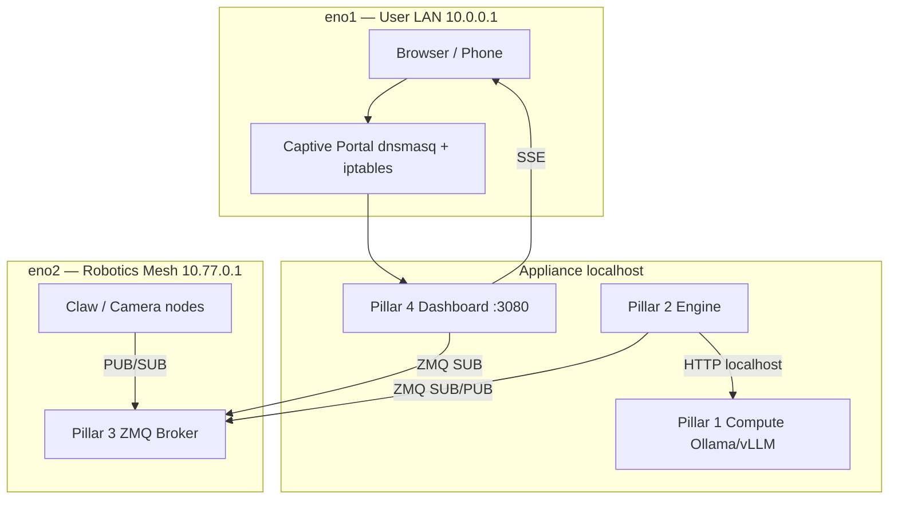

# Architecture Overview

CurXor OS is a four-pillar edge appliance stack for local inference, physical agent control, robotics telemetry, and operator UI.

## System diagram



## Four pillars

| Pillar | Path | Role | Systemd unit |
|--------|------|------|--------------|
| **1 — Compute** | `pillar-1-compute/` | ROCm Docker inference (Ollama / vLLM) | `curxor-compute.service` |
| **2 — Engine** | `pillar-2-engine/` | OpenClaw physical agent loop | `curxor-engine.service` |
| **3 — Telemetry** | `pillar-3-telemetry/` | ZeroMQ XSUB/XPUB mesh broker | `curxor-telemetry-broker.service` |
| **4 — Dashboard** | `pillar-4-dashboard/` | Next.js Flight Command UI | `curxor-dashboard.service` |

## Master target

`/etc/systemd/system/curxor-os.target` groups all pillar services:

```ini
Wants=curxor-compute.service curxor-telemetry-broker.service
       curxor-engine.service curxor-dashboard.service
After=curxor-compute.service curxor-telemetry-broker.service
```

Use `Wants=` (not hard `Requires=`) so one failed pillar does not brick the entire appliance.

```bash
sudo systemctl restart curxor-os.target
```

## Data flows

### Vision (camera → UI / engine)

```
Robot PUB → broker XSUB :9100 → XPUB :9101 → engine SUB + dashboard SUB
Topic: telemetry/vision_in
```

### Motor (engine → robot)

```
Engine PUB → broker XSUB :9200 → XPUB :9201 → robot SUB
Topic: telemetry/motor_out
Wire: 40-byte struct (see Telemetry guide)
```

### Inference (engine → compute)

```
Engine → 127.0.0.1:11434 (Ollama) or 127.0.0.1:8000/v1 (vLLM)
Cloud URLs rejected at engine startup
```

### Dashboard SSE (server → browser)

Browsers cannot speak ZeroMQ. The dashboard Node runtime subscribes to mesh XPUB ports and fans out via SSE:

| SSE route | Source |
|-----------|--------|
| `/api/stream/vision` | Mesh vision XPUB |
| `/api/stream/motor` | Mesh motor XPUB |
| `/api/stream/ota-logs` | `/var/log/curxor/ota-update.log` |

## Directory layout

```
/opt/curxor/
├── version.json                 # local OTA version
├── scripts/                     # meta-installer, OTA, mesh, captive portal
├── config/                      # ota, captive-portal, cloud-init fragments
├── systemd/curxor-os.target
├── pillar-1-compute/
├── pillar-2-engine/
├── pillar-3-telemetry/
└── pillar-4-dashboard/
```

## State and secrets

| Path | Purpose |
|------|---------|
| `/etc/curxor/*.env` | Pillar configuration |
| `/etc/curxor/engine.env.d/active-claw.conf` | Active claw profile (wizard-written) |
| `/var/lib/curxor/models/` | Model weights (Pillar 1 bind mounts) |
| `/var/log/curxor/` | OTA and operational logs |
| `/var/backups/curxor/` | OTA pre-update tarballs |

## Design principles

1. **Sovereign edge** — inference and agent control never leave localhost
2. **Network isolation** — eno1 (users) and eno2 (robots) are separate concerns
3. **Physical-only engine** — digital/cloud tools purged from OpenClaw pivot
4. **Offline UI** — fonts and assets bundled; no CDN dependencies

## Related guides

- [Networking](03-networking.md)
- [Engine & Claws](05-engine-and-claws.md)
- [Flight Command Dashboard](07-flight-command-dashboard.md)
